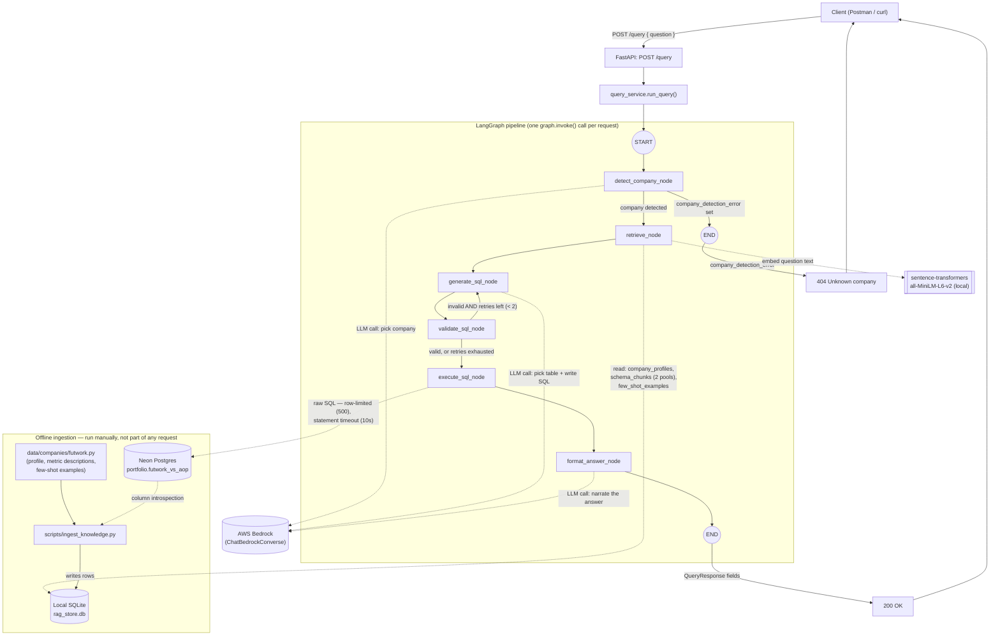

# Architecture

## Review of the hand-drawn diagram

What it got right: `generate_sql_node` → `validate_sql_node` → (loop back to
`generate_sql_node` on failure) → `execute_sql_node` → `format_answer_node` is
the real shape of the retry loop, and the plain-language column on the right
correctly captures the *intent* of each step.

What's missing — this doc adds it back:

1. **The whole first stage: `detect_company_node`.** The diagram starts at
   `retrieve_node`, but as of the latest redesign, the pipeline's actual entry
   point is company detection — an LLM call that reads the question and picks
   which known company it's about (or fails with `UNKNOWN`). Nothing
   downstream can run without this; a failure here skips straight to `END`
   instead of ever reaching `retrieve_node`.
2. **The loop-back is conditional, not unconditional.** `validate_sql_node`
   only routes back to `generate_sql_node` if the SQL is invalid *and* fewer
   than 2 retries have happened so far. Once retries are exhausted, it
   proceeds to `execute_sql_node` regardless — which has its own internal
   guard that refuses to run SQL that's still invalid, turning it into a
   graceful error message rather than looping forever or crashing.
3. **No external systems at all.** Three separate systems make this pipeline
   work, and none of them appear in the diagram: **AWS Bedrock** (the LLM,
   called three separate times per request — detect company, generate+pick
   table, format the final answer), a **local SQLite file** (the RAG
   knowledge base `retrieve_node` reads from), and **Neon Postgres** (the
   real financial data table `execute_sql_node` runs SQL against). These are
   two *different* databases doing two *different* jobs — conflating them
   would be a real misunderstanding of the system.
4. **`retrieve_node` isn't just "retrieve relevant columns."** It pulls three
   different things in one call: the company's business profile (exact
   lookup, no similarity search), schema/column descriptions ranked by cosine
   similarity — split into *two independent pools* (distinct metrics vs.
   per-client columns, so 100+ near-duplicate per-client columns can never
   crowd out a genuinely relevant distinct metric), and similar past
   question→SQL examples (also ranked by similarity). All of that similarity
   ranking happens in local Python now (not a database), against embeddings
   from a local `sentence-transformers` model — no network call.
5. **`generate_sql_node` also picks the table, not just the SQL.** The LLM is
   shown every table the detected company is allowed to query and picks the
   correct one itself — this used to be a hardcoded Python decision, and
   isn't visible at all in a diagram that just says "generate SQL query."
6. **Where the RAG knowledge actually comes from isn't shown.** The SQLite
   file `retrieve_node` reads from doesn't populate itself — a separate,
   offline script (`scripts/ingest_knowledge.py`) introspects Neon's real
   columns and writes descriptions into it. This never runs as part of a
   request; it's a one-time (or re-run-when-data-changes) setup step.
7. **The HTTP layer is invisible.** There's a `POST /query` FastAPI endpoint,
   request/response validation, and a thin service layer wrapping the graph
   — worth showing since it's what a client actually talks to.
8. **No caching layer, on purpose.** Worth stating explicitly rather than
   leaving it ambiguous: this project *used to* have a Redis cache in front
   of the graph and it was deliberately removed. Every request today runs
   the full pipeline, every time.

## Corrected architecture diagram

## Node-by-node

| Node | What it does | Talks to |
|---|---|---|
| `detect_company_node` | LLM reads the question, picks which known company it's about (or `UNKNOWN`) | Bedrock |
| `retrieve_node` | Fetches business profile (exact match) + schema descriptions (two similarity-ranked pools) + few-shot examples (similarity-ranked), all scoped to the detected company | SQLite, local embedding model |
| `generate_sql_node` | LLM picks the correct table from the company's allowed list and writes a SELECT query, grounded in the retrieved context; on a retry, also sees the previous validation error | Bedrock |
| `validate_sql_node` | Rule-based, no LLM: must be `SELECT`, must not contain forbidden keywords (`INSERT`/`DROP`/etc.), must reference one of the company's allowed tables | — |
| `execute_sql_node` | Refuses to run if validation still failed; otherwise row-limits and timeout-boxes the SQL and runs it for real, serializing `Decimal`/`date` values | Neon |
| `format_answer_node` | LLM turns the raw rows (or an execution error) into a plain-English answer, grounded with the company's business profile for currency/units | Bedrock |

## Error handling — two different shapes

- **Unknown company** (`detect_company_node` fails): the graph ends
  immediately, before any retrieval/generation work happens, and the API
  layer turns this into an HTTP **404**.
- **Bad SQL / execution failure** (validation or execution fails even after
  retries): the graph still runs all the way to `format_answer_node`, which
  turns the failure into a plain-English explanation. The API layer returns
  this as a normal **200** with the error described in the response body —
  a deliberate choice (a request that got far enough to generate *some* SQL
  isn't the same failure class as "I don't know who you're asking about").

## What's intentionally not here

- **No cache.** Every request pays full pipeline latency (3 LLM calls + a
  live Neon query), every time — Redis/caching was removed on purpose.
- **No migrations tool.** Both databases' tables are created via
  `Base.metadata.create_all()`/`RagBase.metadata.create_all()` at startup,
  not versioned migrations.
- **Only one company, one table today.** The registries (`_COMPANY_DATA` in
  `nodes.py`, `TABLES` in `data/companies/futwork.py`) are built to hold
  more than one entry without further code changes, but only Futwork/one
  table exist right now.
