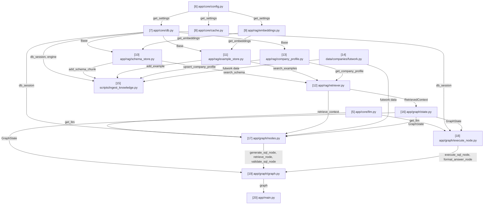

# rag-text-to-sql — Notes & Timeline

Short, plain notes on every file created, in the order it was created, plus two
graphs so the project's history and structure are visible at a glance.

## Timeline

Every file with real content or behavior, in strict creation order (includes
`.gitignore`, README, config files — everything except empty/near-empty
`__init__.py` package markers, which are pure Python plumbing with nothing to
study and are omitted here). Each node is numbered by creation order.

```
[1] .gitignore
     |
     v
[2] README.md
     |
     v
[3] requirements.txt
     |
     v
[4] .env
     |
     v
[5] app/core/llm.py
     |
     v
[6] app/core/config.py
     |
     v
[7] app/core/db.py
     |
     v
[8] app/core/cache.py
     |
     v
[9] app/rag/embeddings.py
     |
     v
[10] app/rag/schema_store.py
     |
     v
[11] app/rag/example_store.py
     |
     v
[12] app/rag/retriever.py
     |
     v
[13] app/rag/company_profile.py
     |
     v
[14] data/companies/futwork.py
     |
     v
[15] scripts/ingest_knowledge.py
     |
     v
[16] app/graph/state.py
     |
     v
[17] app/graph/nodes.py
     |
     v
[18] app/graph/execute_node.py
     |
     v
[19] app/graph/graph.py
     |
     v
[20] app/main.py  <-- NEXT (update this marker as files are added; note: this
     is an early/minimal test harness built ahead of build order — see its
     file note for why it's out of sequence)
```

## Routes Graph (import / dependency connections)

This is ONE single graph covering the whole project — never split into
multiple smaller diagrams scattered through this file. It is different from
the Timeline above: the Timeline shows every file with real content in
creation order, while the Routes Graph only shows files that actually contain
import-relevant logic — skip `.gitignore`, `.env`/config files, READMEs,
dependency manifests, and any `__init__.py` package-marker file — even one
that imports submodules for side effects (e.g. table registration), since
that's plumbing, not something a reader needs to trace to understand
file-to-file data flow.
Every arrow means "the file at the tail is imported by the file at the head,"
labeled with *what* it imports.

**The number in each node's label is its own sequence number within THIS
graph only — it does NOT match the Timeline number for the same file.** A
file might be the 6th file created overall (Timeline `[6]`) but only the 2nd
file that participates in the import graph (Routes Graph node `2`) — that's
exactly `app/core/config.py` below. Always state both numbers when
introducing a new Routes Graph node, to avoid confusing the two.

**This is a Mermaid diagram** (` ```mermaid `, `graph TD`) — GitHub and VS
Code render it automatically as an actual flowchart with boxes and arrows,
not raw text; hand-drawn ASCII arrows do not scale past a handful of nodes
and should not be used here. It is a living document: when a new file joins
the import graph, add its node and edges to this SAME diagram in place — do
not create a second Routes Graph elsewhere in this file, and do not leave
old now-superseded versions behind. Label each edge with what it imports
(e.g. `n2 -->|get_db| n6`) — this makes a separate connections list
unnecessary, since the labels carry that information directly.



## File notes

No analogies here — plain, factual logic and motive only (analogies belong in
chat and in CLAUDE.md, not here).

### [1] .gitignore
- Motive: Keep generated/environment files (`.venv/`, `__pycache__/`) and secrets
  (`.env`) out of version control from the very first commit.
- Logic: Standard Python ignore patterns — byte-compiled files, virtual
  environments, `.env*` (except `.env.example`/`.env.sample`), test/coverage
  caches, IDE and OS files.

### [2] README.md
- Motive: Give the repo a minimal landing page before any real code exists.
- Logic: Project title, one-paragraph description, and a placeholder Getting
  Started section with venv/install commands.

### [3] requirements.txt
- Motive: Placeholder dependency manifest so the project has a known place to
  track Python packages as they're added.
- Logic: Empty aside from a header comment; populated as each lesson adds a
  real dependency.

### [4] .env
- Motive: Hold real credentials (AWS Bedrock, Neon Postgres, Redis) locally,
  outside version control (git-ignored by `.gitignore` entry `[1]`).
- Logic: Empty at creation; populated by the user as each service's
  credentials are supplied during the build.

### [5] app/core/llm.py (Routes Graph node 1)
- Motive: Every module that needs to call the LLM (RAG retriever, LangGraph
  SQL-generation/validation nodes) should get its client the same way, from
  one place, so model/region/credential configuration lives in a single
  location instead of being duplicated.
- Logic: `_env()` reads and strips an environment variable with an optional
  default. `_env_float()` does the same and casts to `float`, treating unset
  or empty as "use default." `get_llm()` reads `BEDROCK_CHAT_MODEL_ID`,
  `BEDROCK_REGION` (falling back to `AWS_REGION`), and `AWS_PROFILE` from
  the environment, raises `ValueError` if model ID or region is missing,
  and returns a configured `ChatBedrockConverse` instance with
  `temperature` defaulting to `0` for deterministic SQL generation.
  `credentials_profile_name` is only passed when a profile is set, so the
  same code works with IAM-role-based credentials in a deployed environment.

### [6] app/core/config.py (Routes Graph node 2)
- Motive: Give the DB, cache, and embedding modules a single, typed,
  validated source of configuration instead of each reading raw env vars
  directly.
- Logic: `_env()`/`_env_int()` read and cast environment variables the same
  way as `llm.py`'s helpers. `Settings` is a frozen dataclass holding
  `database_url`, `redis_url`, `embedding_model_name`, `cache_ttl_seconds`.
  `get_settings()` reads `DATABASE_URL` and `REDIS_URL` (required, raises
  `ValueError` if missing), `EMBEDDING_MODEL_NAME` (defaults to
  `sentence-transformers/all-MiniLM-L6-v2`), and `CACHE_TTL_SECONDS`
  (defaults to `3600`), and is wrapped in `functools.lru_cache` so the
  environment is read and validated exactly once per process, with every
  caller sharing the same `Settings` instance. Imported by `app/core/db.py`,
  `app/core/cache.py`, and `app/rag/embeddings.py`.
  (Note: the embedding field/env-var was renamed from `embedding_model_id`/
  `BEDROCK_EMBEDDING_MODEL_ID` in lesson 5, when embeddings moved off Bedrock
  to a local open-source model — updated here to stay accurate.)

### [7] app/core/db.py (Routes Graph node 3)
- Motive: Give every part of the app that needs to read/write Neon Postgres
  (pgvector stores, SQL execution node, ingestion script) one shared engine
  and session factory, instead of each opening its own connection.
- Logic: `_to_psycopg_url()` rewrites a plain `postgresql://`/`postgres://`
  connection string to `postgresql+psycopg://` so SQLAlchemy loads the
  psycopg (v3) driver. `engine` is created from that URL with
  `pool_pre_ping=True` (needed because Neon can suspend idle connections;
  pre-ping verifies a pooled connection is alive before reuse).
  `SessionLocal` is a session factory with `autoflush`/`autocommit` off.
  `Base` is the empty `DeclarativeBase` subclass future ORM table models
  will inherit from. `init_pgvector_extension()` runs
  `CREATE EXTENSION IF NOT EXISTS vector` once, in its own transaction.
  `get_db()` is a generator-shaped FastAPI dependency (yields a session,
  closes it in `finally`). `db_session()` is a context manager for non-FastAPI
  code — commits on success, rolls back and re-raises on exception, always
  closes. Imports `get_settings` from `app/core/config.py` (Timeline `[6]`,
  Routes Graph node 2).
  **Corrected post-hoc** (lesson 12): `SessionLocal` also gained
  `expire_on_commit=False`. Without it, ORM objects returned from a
  `db_session()` block (e.g. the `SchemaChunk`/`FewShotExample` lists inside
  a `RetrievedContext`, returned by `app/graph/nodes.py`'s `retrieve_node()`)
  raised `DetachedInstanceError` the instant their attributes were accessed
  outside that session — discovered when `generate_sql_node()` tried to read
  `chunk.schema_name` after `retrieve_node()`'s session had already closed.

### [8] app/core/cache.py (Routes Graph node 4)
- Motive: Give `query_service.py` (and anything else that wants to cache
  something) a simple, reusable get/set interface over Redis, so it doesn't
  need to know about connection URLs, JSON encoding, or key hashing.
- Logic: `get_redis_client()` builds a single `redis.Redis` client from
  `settings.redis_url` (`decode_responses=True` so values come back as
  `str`), cached via `lru_cache` so the whole process shares one client.
  `make_cache_key(namespace, *parts)` strips/lowercases each part, joins
  them, and SHA-256 hashes the result into a fixed-length key prefixed with
  `namespace`, so near-identical inputs (case/whitespace differences) share
  a cache entry. `cache_get(key)` returns the JSON-decoded value or `None`
  on a miss. `cache_set(key, value, ttl=None)` JSON-encodes `value` and
  stores it with Redis's built-in expiry (`ex=`), defaulting to
  `settings.cache_ttl_seconds` if no explicit `ttl` is given. Imports
  `get_settings` from `app/core/config.py` (Timeline `[6]`, Routes Graph
  node 2).

### [9] app/rag/embeddings.py (Routes Graph node 5)
- Motive: The schema store, example store, and retriever all need to turn
  text into vectors the same way; centralizing that avoids each one loading
  its own copy of the embedding model into memory, and keeps the model
  swappable via config rather than hardcoded.
- Logic: `get_embeddings()` builds a LangChain `HuggingFaceEmbeddings`
  instance from `settings.embedding_model_name` (default
  `sentence-transformers/all-MiniLM-L6-v2`, an open-source model that runs
  fully locally on CPU, no API calls or credentials — chosen instead of a
  Bedrock embedding model per explicit decision to keep RAG embeddings
  open-source). Wrapped in `functools.lru_cache` since loading model
  weights is expensive and should happen once per process. Produces
  384-dimensional vectors, verified by a smoke test (`embed_query` returned
  a length-384 list). This dimension constrains the pgvector column type
  (`vector(384)`) in the schema/example stores built next. Imports
  `get_settings` from `app/core/config.py` (Timeline `[6]`, Routes Graph
  node 2).

### [10] app/rag/schema_store.py (Routes Graph node 6)
- Motive: There was no way to store or search financial schema knowledge
  (what a table/column means) before this. This gives RAG retrieval a real
  place to read from, and gives an ingestion process a real place to write
  to.
- Logic: `SchemaChunk` is an ORM model (table `schema_chunks`) with `company`,
  `schema_name`, `table_name`, an optional `column_name`, a `description`
  text field (the natural-language text that gets embedded), an `embedding`
  column of type `Vector(384)` (must match the embedding model's output
  dimension), and `is_per_entity` (`Boolean`, default `False` — see the
  lesson 12 correction below). `add_schema_chunk(db, company, schema_name,
  table_name, description, column_name=None, is_per_entity=False)` embeds
  `description` via `get_embeddings().embed_query()`, builds a `SchemaChunk`,
  and stages+flushes it (flush pushes the INSERT within the current
  transaction and populates the generated `id`, without committing — leaves
  commit/rollback timing to the caller). `search_schema(db, company, query,
  top_k=5, is_per_entity=None)` embeds `query`, then runs
  `SELECT ... WHERE company = :company [AND is_per_entity = :flag]
  ORDER BY embedding <=> :query_vector LIMIT top_k` via pgvector's
  `cosine_distance()` SQLAlchemy operator (the `is_per_entity` filter only
  applies when explicitly passed `True`/`False`, not `None`) — the actual
  distance computation runs inside Postgres, not in Python, and the
  `company` filter applies *before* similarity ordering so one company's
  data can never surface in another's retrieval. Imports `Base` from
  `app/core/db.py` (Timeline `[7]`, Routes Graph node 3) and
  `get_embeddings` from `app/rag/embeddings.py` (Timeline `[9]`, Routes
  Graph node 5).
  **Corrected post-hoc** (lesson 12, a genuine bug found via live testing,
  not a preference change): asking "what was the total revenue in March
  2026?" retrieved zero occurrences of `total_revenue` even at `top_k=15` —
  every slot was filled by one of the 55 near-identical
  `billing_amount_<client>` descriptions, which cluster so tightly in
  embedding space that they can completely crowd out a genuinely more
  relevant distinct metric. Added `is_per_entity` (`True` for the 110
  per-client `billing_amount_*`/`minutes_spoken_*` columns, `False` for the
  67 distinct metrics) so `retriever.py` (below) can query both pools
  independently and guarantee a distinct metric is never crowded out.
  Required dropping and recreating the (by then non-empty, 177-row) table —
  see `CLAUDE.md`'s Known gaps for why that's a real migrations gap, not
  just a lesson-6-era one.
  **History**: originally built without `company`/`schema_name` (verified
  end-to-end then: table created, `net_margin` correctly ranked above
  `revenue` for a profit-margin query, test rows removed). **Corrected
  post-hoc** once real Futwork data turned out to live in
  `portfolio.futwork_vs_aop` (not `public`) and multi-tenancy became a
  requirement — the (still-empty) table was dropped and recreated with the
  new columns, then re-verified: inserted a real `hitl` chunk for company
  `futwork`, confirmed `search_schema()` for a *different* company correctly
  returns `[]`, then removed the verification row.

### [11] app/rag/example_store.py (Routes Graph node 7)
- Motive: Give few-shot NL→SQL examples (question paired with the correct
  SQL for it) a real place to be stored and searched, the same way schema
  knowledge got one in lesson 6.
- Logic: `FewShotExample` is an ORM model (table `few_shot_examples`) with
  `company`, `question` (Text), `sql` (Text, the correct SQL for that
  question), and `embedding` (`Vector(384)`). Only `question` is embedded,
  never `sql` — retrieval is meant to find questions similar in *intent*,
  not SQL statements similar in shape. `add_example(db, company, question,
  sql)` embeds `question` and stages+flushes a new row. `search_examples(db,
  company, query, top_k=3)` embeds `query` and runs the same
  company-filtered, pgvector cosine-distance search as `search_schema()`,
  defaulting to fewer results (3 instead of 5) since few-shot prompts work
  best with a handful of examples. Imports `Base` from `app/core/db.py`
  (Timeline `[7]`, Routes Graph node 3) and `get_embeddings` from
  `app/rag/embeddings.py` (Timeline `[9]`, Routes Graph node 5).
  **History**: originally built without `company` (verified then: table
  created, profit-margin example correctly ranked first, test rows
  removed). **Corrected post-hoc** alongside `schema_store.py` for the same
  multi-tenancy reason — table dropped and recreated with the new column.

### [12] app/rag/retriever.py (Routes Graph node 8)
- Motive: The SQL-generation node (built next in the `app/graph/` lessons)
  shouldn't need to know there are two separate stores with two separate
  searches — this file combines both into one call and one ready-to-use
  block of prompt text.
- Logic: `RetrievedContext` is a frozen dataclass holding `company_profile`
  (`str | None`), `schema_chunks`, and `examples`. Its `to_prompt_text()`
  method opens with a "Business context" section (the company's profile
  text, or `"(none found)"`), then formats each schema chunk as
  `"- schema.table.column: description"` (or `"- schema.table: description"`
  when there's no column — the schema-qualified form was added so the LLM
  writes `FROM portfolio.futwork_vs_aop`, not an unqualified/wrong-schema
  guess) and each example as `"Q: ...\nSQL: ..."`, falling back to
  `"(none found)"` for the schema/example sections too when nothing was
  retrieved. `retrieve_context(db, company, question, schema_top_k=5,
  per_entity_top_k=3, example_top_k=3)` fetches the company's profile via
  `get_company_profile()`, runs **two independent** `search_schema()` calls
  — one with `is_per_entity=False` (distinct metrics) and one with
  `is_per_entity=True` (per-client columns) — concatenates their results
  (distinct metrics first), and calls `search_examples()` for the same
  `company`/`question`, bundling all three into one `RetrievedContext`.
  Imports `get_company_profile` from `app/rag/company_profile.py` (Timeline
  `[13]`, Routes Graph node 9), `search_schema` from
  `app/rag/schema_store.py` (Timeline `[10]`, Routes Graph node 6), and
  `search_examples` from `app/rag/example_store.py` (Timeline `[11]`,
  Routes Graph node 7).
  **History**: originally built without `company`/business-context
  (verified then: empty-knowledge-base fallback text, then combined
  schema+example retrieval, test rows removed). **Corrected post-hoc**
  alongside the other multi-tenancy changes; re-verified with the real
  Futwork profile, a real `hitl` schema chunk, and a real example row —
  confirmed the full three-section prompt renders correctly and that a
  different company's `search_schema()` call returns `[]`.
  **Corrected again in lesson 12**: `retrieve_context()` originally made a
  single `search_schema()` call with no `is_per_entity` split — this was
  the actual site of the "`total_revenue` never appears" bug (see
  `schema_store.py`'s note above for the full diagnosis). Re-verified with
  the two-pool split: `total_revenue` now appears in the distinct-metrics
  pool, and per-client questions (e.g. "billing amount from BharatPe") still
  correctly surface the right per-entity column from its own pool.

### [13] app/rag/company_profile.py (Routes Graph node 9)
- Motive: Schema/example knowledge alone doesn't tell the LLM *how a
  company's numbers should be interpreted* (e.g. that HITL vs AI+Workflows
  is a revenue split, or that billing is output-based, not per-seat). This
  gives that business narrative a real home, scoped per company for when
  more companies are added later.
- Logic: `CompanyProfile` is an ORM model (table `company_profiles`) with
  `company` as the primary key and `profile` as a plain `Text` field — no
  embedding column, because there's only ever one row per company to fetch
  (an exact primary-key lookup), not "the most similar profile among many,"
  so vector search adds nothing here. `get_company_profile(db, company)`
  returns the row (or `None`) via `db.get()`. `upsert_company_profile(db,
  company, profile)` updates the existing row if one exists for that
  company, otherwise inserts a new one, staging+flushing either way.
  Imports `Base` from `app/core/db.py` (Timeline `[7]`, Routes Graph node
  3). Verified against the real Neon RAG branch: the confirmed Futwork
  business profile was stored for real (not test data — kept, unlike the
  schema/example verification rows), and a lookup for a nonexistent company
  correctly returned `None`.

### [14] data/companies/futwork.py (Routes Graph node 10)
- Motive: Separates *data* (what the 67 metrics mean, the per-client
  templates, the business profile, the few-shot examples) from *logic*
  (how to turn that data into database rows) — keeps the ingestion script
  reusable for a future second company's data module.
- Logic: Pure data, no functions. `COMPANY`, `SCHEMA_NAME`, `TABLE_NAME`
  identify which company/view this module describes. `PROFILE` is the
  confirmed Futwork business narrative. `EXCLUDED_COLUMNS` lists dimension/
  key columns that never become schema chunks (`id`, `file_path`,
  `month_name`, `year`). `PER_CLIENT_TEMPLATES` holds the 2 confirmed
  templates (`billing_amount`, `minutes_spoken`) with a `{client}`
  placeholder. `METRIC_DESCRIPTIONS` maps all 67 confirmed distinct column
  names to their plain-English descriptions. `FEW_SHOT_EXAMPLES` is a list
  of 5 confirmed `(question, sql)` pairs, deliberately avoiding "most
  recent month" style queries since `month_name` is text and sorts
  alphabetically, not chronologically.
  **Corrected post-hoc in lesson 13**: all 5 examples originally used
  capitalized month names (`'March'`) in their SQL. The real data stores
  `month_name` lowercase (`'march'`) — Postgres string comparison is
  case-sensitive, so every example's SQL silently matched zero rows despite
  being otherwise correct. Fixed to lowercase and re-ingested; see
  `nodes.py`'s note below for the matching system-prompt fix.

### [15] scripts/ingest_knowledge.py (Routes Graph node 11)
- Motive: Turns the data in `futwork.py` into real rows in all three RAG
  tables — the one piece of code that actually populates the knowledge
  base, rather than just being capable of holding it.
- Logic: `_PER_CLIENT_PATTERN` is a regex built from
  `PER_CLIENT_TEMPLATES`'s own keys (e.g.
  `^(billing_amount|minutes_spoken)_(.+)$`), so adding a new template
  automatically extends the pattern. `_describe_column(column_name)`
  returns a `(description, is_per_entity)` tuple: matches a column against
  that pattern first (filling `{client}` from the captured group, returning
  `is_per_entity=True`), falling back to an exact `METRIC_DESCRIPTIONS`
  lookup (`is_per_entity=False`); returns `None` if neither matches.
  `ingest()` introspects the *real* columns of `portfolio.futwork_vs_aop`
  via `sqlalchemy.inspect()` (not a hardcoded list — a new client column
  added later is picked up automatically), deletes this company's existing
  `schema_chunks`/`few_shot_examples` rows first (making the script
  idempotent/re-runnable as descriptions change), upserts the company
  profile, then loops every real column: skips `EXCLUDED_COLUMNS`, calls
  `_describe_column()`, and either inserts a `SchemaChunk` (passing through
  `is_per_entity`) or records the column name as skipped (an unknown column
  is surfaced via a warning, never silently guessed). Finally seeds the 5
  `FEW_SHOT_EXAMPLES`. Imports `db_session`/`engine` from `app/core/db.py`
  (Timeline `[7]`, Routes Graph node 3), `add_schema_chunk` from
  `app/rag/schema_store.py` (Timeline `[10]`, Routes Graph node 6),
  `add_example` from `app/rag/example_store.py` (Timeline `[11]`, Routes
  Graph node 7), `upsert_company_profile` from `app/rag/company_profile.py`
  (Timeline `[13]`, Routes Graph node 9), and the data itself from
  `data/companies/futwork.py` (Timeline `[14]`, Routes Graph node 10).
  **Verified for real** against the Neon RAG branch: ingested 177 schema
  chunks (67 metrics + 55 clients × 2 templates) and 5 examples for
  `futwork`, zero columns skipped/unknown. Spot-checked retrieval quality
  on 3 real questions afterward via `retrieve_context()` — all returned
  sensible top matches (e.g. "revenue per minute for Amazon" correctly
  surfaced both `billing_amount_amazon` and `minutes_spoken_amazon`).
  **Corrected post-hoc in lesson 12**: `_describe_column()` originally
  returned just a description string, with no `is_per_entity` signal — this
  script was updated (and the whole table re-ingested from scratch) as part
  of the retrieval-crowding-out bug fix documented in `schema_store.py`'s
  and `retriever.py`'s notes above.

### [16] app/graph/state.py (Routes Graph node 12)
- Motive: Every LangGraph node in this workflow reads from and writes to
  one shared object rather than calling each other directly. Without a
  single agreed-upon shape for that object, a typo in one node's dict key
  would fail silently at runtime instead of being caught upfront.
- Logic: `GraphState` is a single `TypedDict` covering the whole pipeline:
  `company`/`question` are the only required fields (supplied by whoever
  starts the graph); `retrieved_context` (set by the retrieve node),
  `generated_sql`/`validation_error`/`retry_count` (set by the generate/
  validate nodes — `validation_error` drives a conditional retry edge, and
  `retry_count` caps how many retries are allowed), `sql_result`/
  `execution_error` (set by the execute node), and `final_answer` (set by
  the format node) are all `NotRequired` (standard-library `typing`,
  Python 3.11+) since they're populated progressively as the graph runs,
  not known up front. Imports `RetrievedContext` from
  `app/rag/retriever.py` (Timeline `[12]`, Routes Graph node 8). Verified
  by constructing a minimal `GraphState` with only `company`/`question`
  set, confirming the `NotRequired` fields are genuinely optional.

### [17] app/graph/nodes.py (Routes Graph node 13)
- Motive: This is where the pipeline's actual intelligence lives — turning
  retrieved context into a candidate SQL query and checking it's safe
  before anything touches the real database.
- Logic: `_COMPANY_DATA` is a small dict mapping a company string to its
  data module (currently just `{"futwork": futwork}`) — a minimal registry,
  not a plugin system, since there's one company today.
  `_strip_code_fences()` defensively removes markdown code fences an LLM
  might wrap SQL in despite being told not to. `retrieve_node(state)` opens
  a `db_session()`, calls `retrieve_context()`, and returns
  `{"retrieved_context": ...}` for LangGraph to merge into state.
  `generate_sql_node(state)` builds a system prompt naming the one table
  this company may query (read dynamically from its data module, not
  hardcoded text) plus the retrieved context and question, appends the
  previous validation error to the prompt on a retry (so the LLM can
  self-correct), calls `get_llm()`, and strips code fences from the
  response. `validate_sql_node(state)` rejects anything that isn't a
  `SELECT`, rejects a fixed list of forbidden keywords
  (`INSERT`/`UPDATE`/`DELETE`/`DROP`/etc., via `\b`-bounded regex so
  `DROPDOWN` doesn't false-positive on `DROP`), and rejects SQL that
  doesn't reference the allowed table — each failure sets
  `validation_error` and increments `retry_count`, but the actual
  retry-vs-proceed *decision* belongs to `graph.py` (lesson 14), not this
  node. Imports `get_llm` from `app/core/llm.py` (Timeline `[5]`, Routes
  Graph node 1), `db_session` from `app/core/db.py` (Timeline `[7]`, Routes
  Graph node 3), `retrieve_context` from `app/rag/retriever.py` (Timeline
  `[12]`, Routes Graph node 8), `futwork` data from
  `data/companies/futwork.py` (Timeline `[14]`, Routes Graph node 10), and
  `GraphState` from `app/graph/state.py` (Timeline `[16]`).
  **Corrected post-hoc in lesson 13**: `generate_sql_node`'s system prompt
  gained an explicit instruction that `month_name` filters must use
  lowercase full month names — added after live testing showed the LLM
  (and the few-shot examples themselves) defaulting to capitalized month
  names, which silently matched zero rows against the real, lowercase data.
  **Verified for real** against Bedrock + Neon: the full retrieve → generate
  → validate chain produced correct, validated SQL for multiple real
  questions (total revenue, per-client billing, caller churn, runway) after
  the retrieval-crowding-out bug (documented in `schema_store.py`'s and
  `retriever.py`'s notes) was found and fixed via this same testing.

### [18] app/graph/execute_node.py (Routes Graph node 14)
- Motive: Validated SQL still has to actually run against Neon, and raw
  rows still have to become a plain-English answer — these are the two
  remaining stages of the pipeline.
- Logic: `_apply_row_limit(sql, limit=500)` strips a trailing `;` and, if
  the SQL has no `LIMIT` already, wraps it as
  `SELECT * FROM (<sql>) AS limited_query LIMIT 500` so an unbounded query
  can't return an unbounded result. `_serialize_value()` converts `Decimal`
  (from `NUMERIC` columns) to `float` and `date`/`datetime` to ISO strings,
  since raw DB types aren't JSON-safe and `cache_set()` (lesson 4) will
  need to JSON-encode this data. `execute_sql_node(state)` first refuses to
  run if `state["validation_error"]` is still set (defense in depth against
  a future routing bug in `graph.py`, not just trusting upstream wiring),
  then opens a `db_session()`, sets a 10-second `SET LOCAL
  statement_timeout` (from the "safely execute AI-generated SQL" article),
  executes the row-limited SQL, and returns serialized rows or an
  `execution_error` string on any exception — never lets a bad query crash
  the whole graph. `format_answer_node(state)` returns a canned message on
  `execution_error` or an empty result set without calling the LLM at all;
  otherwise it prompts the LLM with the question, the JSON rows, and the
  company's business-context text, asking it to narrate the numbers in
  plain English using the correct currency/units — explicitly not assuming
  USD or any default. Imports `get_llm` from `app/core/llm.py` (Timeline
  `[5]`, Routes Graph node 1), `db_session` from `app/core/db.py` (Timeline
  `[7]`, Routes Graph node 3), and `GraphState` from `app/graph/state.py`
  (Timeline `[16]`).
  **Corrected post-hoc, same lesson**: `format_answer_node()` originally
  had no business-context text in its prompt at all — live testing showed
  it defaulting to USD ("$22,063,632") for data that's actually INR, since
  nothing in the raw numbers said otherwise. Fixed by passing
  `state["retrieved_context"].company_profile` into the prompt.
  **Verified for real**: the full 5-stage pipeline (retrieve → generate →
  validate → execute → format) correctly answered "What was the total
  revenue in March 2026?" with "The total revenue for Futwork in March 2026
  was INR 22,063,632." — a real number from a real row. Also verified both
  error paths directly: the validation-error guard refuses to execute, and
  a genuine execution error (nonexistent column) is caught and surfaced as
  a plain-English message rather than crashing.

### [19] app/graph/graph.py (Routes Graph node 15)
- Motive: The five node functions were each independently correct, but
  nothing connected them into an actual workflow or decided what happens
  when validation fails — this file is the wiring and the one real
  decision point in the whole pipeline.
- Logic: `_route_after_validation(state)` is a LangGraph conditional-edge
  function — returns `"generate"` if `validation_error` is set and
  `retry_count < _MAX_RETRIES` (2), else `"execute"`. `build_graph()`
  constructs `StateGraph(GraphState)`, registers all 5 nodes under string
  names (`retrieve`, `generate`, `validate`, `execute`, `format`), wires
  the fixed path `START → retrieve → generate → validate` and
  `execute → format → END` via `add_edge()`, and wires the one variable
  path via `add_conditional_edges("validate", _route_after_validation,
  {"generate": "generate", "execute": "execute"})` — this is what makes a
  validate → generate → validate retry loop possible. `.compile()` turns
  the definition into a runnable object; the module-level `graph =
  build_graph()` is what `query_service.py` (lesson 15) will call
  `.invoke()` on directly. Imports `GraphState` from `app/graph/state.py`
  (Timeline `[16]`), `retrieve_node`/`generate_sql_node`/`validate_sql_node`
  from `app/graph/nodes.py` (Timeline `[17]`, Routes Graph node 13), and
  `execute_sql_node`/`format_answer_node` from `app/graph/execute_node.py`
  (Timeline `[18]`, Routes Graph node 14).
  **Verified for real**: `graph.invoke({"company": "futwork", "question":
  "What was the total revenue in March 2026?"})` correctly returned "The
  total revenue for Futwork in March 2026 was INR 22,063,632." through a
  single call — no manual node chaining needed, confirming the wiring
  itself (not just the individual nodes) works. `_route_after_validation()`
  also tested directly at all four boundary conditions: no error → execute;
  error with retries remaining → generate; error with retries exhausted →
  execute (where `execute_sql_node`'s defense-in-depth guard from lesson 13
  catches it and reports failure cleanly instead of running bad SQL).

### [20] app/main.py (Routes Graph node 16)
- Motive: Built out of build-order sequence, at explicit user request, to
  manually test the compiled graph over real HTTP before the proper
  caching/schema/routing layers (lessons 15-17) exist. Not the final
  lesson-18 file — flagged as such in `CLAUDE.md` so a future session
  doesn't mistake this for finished work.
- Logic: A `FastAPI` app with `QueryRequest` (`company`, `question`) and
  `QueryResponse` (`generated_sql`, `sql_result`, `final_answer`,
  `validation_error`, `execution_error`) as inline Pydantic models — these
  will move into `api/schemas.py` at lesson 16. One `POST /query` endpoint
  calls `graph.invoke({"company": ..., "question": ...})` directly (no
  Redis cache check, since `query_service.py` doesn't exist yet) and maps
  the result dict onto `QueryResponse`. Imports `graph` from
  `app/graph/graph.py` (Timeline `[19]`, Routes Graph node 15).
  **Verified for real**: started with `uvicorn app.main:app`, a live
  `curl POST /query` for "What was the total revenue in March 2026?"
  correctly returned `sql_result: [{"total_revenue": 22063632}]` and
  `final_answer: "The total revenue for Futwork in March 2026 was INR
  22,063,632."` over actual HTTP.
