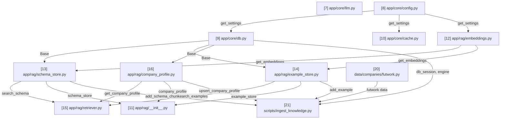

# rag-text-to-sql — Notes & Timeline

Short, plain notes on every file created, in the order it was created, plus two
graphs so the project's history and structure are visible at a glance.

## Timeline

Every file, in strict creation order, no exceptions (includes `.gitignore`,
README, config files — everything). Each node is numbered by creation order.

```
[1] .gitignore
     |
     v
[2] README.md
     |
     v
[3] requirements.txt
     |
     v
[4] .env
     |
     v
[5] app/__init__.py
     |
     v
[6] app/core/__init__.py
     |
     v
[7] app/core/llm.py
     |
     v
[8] app/core/config.py
     |
     v
[9] app/core/db.py
     |
     v
[10] app/core/cache.py
     |
     v
[11] app/rag/__init__.py
     |
     v
[12] app/rag/embeddings.py
     |
     v
[13] app/rag/schema_store.py
     |
     v
[14] app/rag/example_store.py
     |
     v
[15] app/rag/retriever.py
     |
     v
[16] app/rag/company_profile.py
     |
     v
[17] data/__init__.py
     |
     v
[18] data/companies/__init__.py
     |
     v
[19] scripts/__init__.py
     |
     v
[20] data/companies/futwork.py
     |
     v
[21] scripts/ingest_knowledge.py  <-- NEXT (update this marker as files are added)
```

## Routes Graph (import / dependency connections)

This is ONE single graph covering the whole project — never split into
multiple smaller diagrams scattered through this file. It is different from
the Timeline above: the Timeline shows *every* file in creation order, while
the Routes Graph only shows files that actually contain import-relevant
logic — skip `.gitignore`, `.env`/config files, READMEs, dependency
manifests, and empty package-marker files (e.g. Python's `__init__.py`).
Every arrow means "the file at the tail is imported by the file at the head,"
labeled with *what* it imports.

**The number in each node's label is its own sequence number within THIS
graph only — it does NOT match the Timeline number for the same file.** A
file might be the 8th file created overall (Timeline `[8]`) but only the 1st
file that participates in the import graph (Routes Graph node `1`). Always
state both numbers when introducing a new Routes Graph node, to avoid
confusing the two.

**This is a Mermaid diagram** (` ```mermaid `, `graph TD`) — GitHub and VS
Code render it automatically as an actual flowchart with boxes and arrows,
not raw text; hand-drawn ASCII arrows do not scale past a handful of nodes
and should not be used here. It is a living document: when a new file joins
the import graph, add its node and edges to this SAME diagram in place — do
not create a second Routes Graph elsewhere in this file, and do not leave
old now-superseded versions behind. Label each edge with what it imports
(e.g. `n2 -->|get_db| n6`) — this makes a separate connections list
unnecessary, since the labels carry that information directly.



## File notes

No analogies here — plain, factual logic and motive only (analogies belong in
chat and in CLAUDE.md, not here).

### [1] .gitignore
- Motive: Keep generated/environment files (`.venv/`, `__pycache__/`) and secrets
  (`.env`) out of version control from the very first commit.
- Logic: Standard Python ignore patterns — byte-compiled files, virtual
  environments, `.env*` (except `.env.example`/`.env.sample`), test/coverage
  caches, IDE and OS files.

### [2] README.md
- Motive: Give the repo a minimal landing page before any real code exists.
- Logic: Project title, one-paragraph description, and a placeholder Getting
  Started section with venv/install commands.

### [3] requirements.txt
- Motive: Placeholder dependency manifest so the project has a known place to
  track Python packages as they're added.
- Logic: Empty aside from a header comment; populated as each lesson adds a
  real dependency.

### [4] .env
- Motive: Hold real credentials (AWS Bedrock, Neon Postgres, Redis) locally,
  outside version control (git-ignored by `.gitignore` entry `[1]`).
- Logic: Empty at creation; populated by the user as each service's
  credentials are supplied during the build.

### [5] app/__init__.py
- Motive: Marks `app/` as a Python package so its submodules (`app.core`,
  `app.rag`, etc.) can be imported.
- Logic: Empty file.

### [6] app/core/__init__.py
- Motive: Marks `app/core/` as a Python package for core infrastructure
  modules (LLM client, DB, cache, settings).
- Logic: Empty file.

### [7] app/core/llm.py (Routes Graph node 1)
- Motive: Every module that needs to call the LLM (RAG retriever, LangGraph
  SQL-generation/validation nodes) should get its client the same way, from
  one place, so model/region/credential configuration lives in a single
  location instead of being duplicated.
- Logic: `_env()` reads and strips an environment variable with an optional
  default. `_env_float()` does the same and casts to `float`, treating unset
  or empty as "use default." `get_llm()` reads `BEDROCK_CHAT_MODEL_ID`,
  `BEDROCK_REGION` (falling back to `AWS_REGION`), and `AWS_PROFILE` from
  the environment, raises `ValueError` if model ID or region is missing,
  and returns a configured `ChatBedrockConverse` instance with
  `temperature` defaulting to `0` for deterministic SQL generation.
  `credentials_profile_name` is only passed when a profile is set, so the
  same code works with IAM-role-based credentials in a deployed environment.

### [8] app/core/config.py (Routes Graph node 2)
- Motive: Give the DB, cache, and embedding modules a single, typed,
  validated source of configuration instead of each reading raw env vars
  directly.
- Logic: `_env()`/`_env_int()` read and cast environment variables the same
  way as `llm.py`'s helpers. `Settings` is a frozen dataclass holding
  `database_url`, `redis_url`, `embedding_model_name`, `cache_ttl_seconds`.
  `get_settings()` reads `DATABASE_URL` and `REDIS_URL` (required, raises
  `ValueError` if missing), `EMBEDDING_MODEL_NAME` (defaults to
  `sentence-transformers/all-MiniLM-L6-v2`), and `CACHE_TTL_SECONDS`
  (defaults to `3600`), and is wrapped in `functools.lru_cache` so the
  environment is read and validated exactly once per process, with every
  caller sharing the same `Settings` instance. Imported by `app/core/db.py`,
  `app/core/cache.py`, and `app/rag/embeddings.py`.
  (Note: the embedding field/env-var was renamed from `embedding_model_id`/
  `BEDROCK_EMBEDDING_MODEL_ID` in lesson 5, when embeddings moved off Bedrock
  to a local open-source model — updated here to stay accurate.)

### [9] app/core/db.py (Routes Graph node 3)
- Motive: Give every part of the app that needs to read/write Neon Postgres
  (pgvector stores, SQL execution node, ingestion script) one shared engine
  and session factory, instead of each opening its own connection.
- Logic: `_to_psycopg_url()` rewrites a plain `postgresql://`/`postgres://`
  connection string to `postgresql+psycopg://` so SQLAlchemy loads the
  psycopg (v3) driver. `engine` is created from that URL with
  `pool_pre_ping=True` (needed because Neon can suspend idle connections;
  pre-ping verifies a pooled connection is alive before reuse).
  `SessionLocal` is a session factory with `autoflush`/`autocommit` off.
  `Base` is the empty `DeclarativeBase` subclass future ORM table models
  will inherit from. `init_pgvector_extension()` runs
  `CREATE EXTENSION IF NOT EXISTS vector` once, in its own transaction.
  `get_db()` is a generator-shaped FastAPI dependency (yields a session,
  closes it in `finally`). `db_session()` is a context manager for non-FastAPI
  code — commits on success, rolls back and re-raises on exception, always
  closes. Imports `get_settings` from `app/core/config.py` (Timeline `[8]`,
  Routes Graph node 2).

### [10] app/core/cache.py (Routes Graph node 4)
- Motive: Give `query_service.py` (and anything else that wants to cache
  something) a simple, reusable get/set interface over Redis, so it doesn't
  need to know about connection URLs, JSON encoding, or key hashing.
- Logic: `get_redis_client()` builds a single `redis.Redis` client from
  `settings.redis_url` (`decode_responses=True` so values come back as
  `str`), cached via `lru_cache` so the whole process shares one client.
  `make_cache_key(namespace, *parts)` strips/lowercases each part, joins
  them, and SHA-256 hashes the result into a fixed-length key prefixed with
  `namespace`, so near-identical inputs (case/whitespace differences) share
  a cache entry. `cache_get(key)` returns the JSON-decoded value or `None`
  on a miss. `cache_set(key, value, ttl=None)` JSON-encodes `value` and
  stores it with Redis's built-in expiry (`ex=`), defaulting to
  `settings.cache_ttl_seconds` if no explicit `ttl` is given. Imports
  `get_settings` from `app/core/config.py` (Timeline `[8]`, Routes Graph
  node 2).

### [11] app/rag/__init__.py (Routes Graph node 10)
- Motive: Marks `app/rag/` as a Python package for retrieval-augmented
  generation modules (embeddings, schema store, example store, retriever).
- Logic: Originally empty. **Corrected post-hoc** (alongside the
  multi-tenancy changes) to import `company_profile`, `example_store`, and
  `schema_store` — `Base.metadata.create_all()` only creates tables for
  models that have been imported somewhere first, so importing `app.rag`
  now guarantees all three RAG tables register correctly, discovered when
  `company_profiles` silently failed to get created without this. Imports
  `app/rag/company_profile.py` (Timeline `[16]`), `app/rag/example_store.py`
  (Timeline `[14]`, Routes Graph node 7), `app/rag/schema_store.py`
  (Timeline `[13]`, Routes Graph node 6).

### [12] app/rag/embeddings.py (Routes Graph node 5)
- Motive: The schema store, example store, and retriever all need to turn
  text into vectors the same way; centralizing that avoids each one loading
  its own copy of the embedding model into memory, and keeps the model
  swappable via config rather than hardcoded.
- Logic: `get_embeddings()` builds a LangChain `HuggingFaceEmbeddings`
  instance from `settings.embedding_model_name` (default
  `sentence-transformers/all-MiniLM-L6-v2`, an open-source model that runs
  fully locally on CPU, no API calls or credentials — chosen instead of a
  Bedrock embedding model per explicit decision to keep RAG embeddings
  open-source). Wrapped in `functools.lru_cache` since loading model
  weights is expensive and should happen once per process. Produces
  384-dimensional vectors, verified by a smoke test (`embed_query` returned
  a length-384 list). This dimension constrains the pgvector column type
  (`vector(384)`) in the schema/example stores built next. Imports
  `get_settings` from `app/core/config.py` (Timeline `[8]`, Routes Graph
  node 2).

### [13] app/rag/schema_store.py (Routes Graph node 6)
- Motive: There was no way to store or search financial schema knowledge
  (what a table/column means) before this. This gives RAG retrieval a real
  place to read from, and gives an ingestion process a real place to write
  to.
- Logic: `SchemaChunk` is an ORM model (table `schema_chunks`) with `company`,
  `schema_name`, `table_name`, an optional `column_name`, a `description`
  text field (the natural-language text that gets embedded), and an
  `embedding` column of type `Vector(384)` (must match the embedding model's
  output dimension). `add_schema_chunk(db, company, schema_name, table_name,
  description, column_name=None)` embeds `description` via
  `get_embeddings().embed_query()`, builds a `SchemaChunk`, and
  stages+flushes it (flush pushes the INSERT within the current transaction
  and populates the generated `id`, without committing — leaves
  commit/rollback timing to the caller). `search_schema(db, company, query,
  top_k=5)` embeds `query`, then runs
  `SELECT ... WHERE company = :company ORDER BY embedding <=> :query_vector
  LIMIT top_k` via pgvector's `cosine_distance()` SQLAlchemy operator — the
  actual distance computation runs inside Postgres, not in Python, and the
  `company` filter applies *before* similarity ordering so one company's
  data can never surface in another's retrieval. Imports `Base` from
  `app/core/db.py` (Timeline `[9]`, Routes Graph node 3) and
  `get_embeddings` from `app/rag/embeddings.py` (Timeline `[12]`, Routes
  Graph node 5).
  **History**: originally built without `company`/`schema_name` (verified
  end-to-end then: table created, `net_margin` correctly ranked above
  `revenue` for a profit-margin query, test rows removed). **Corrected
  post-hoc** once real Futwork data turned out to live in
  `portfolio.futwork_vs_aop` (not `public`) and multi-tenancy became a
  requirement — the (still-empty) table was dropped and recreated with the
  new columns, then re-verified: inserted a real `hitl` chunk for company
  `futwork`, confirmed `search_schema()` for a *different* company correctly
  returns `[]`, then removed the verification row.

### [14] app/rag/example_store.py (Routes Graph node 7)
- Motive: Give few-shot NL→SQL examples (question paired with the correct
  SQL for it) a real place to be stored and searched, the same way schema
  knowledge got one in lesson 6.
- Logic: `FewShotExample` is an ORM model (table `few_shot_examples`) with
  `company`, `question` (Text), `sql` (Text, the correct SQL for that
  question), and `embedding` (`Vector(384)`). Only `question` is embedded,
  never `sql` — retrieval is meant to find questions similar in *intent*,
  not SQL statements similar in shape. `add_example(db, company, question,
  sql)` embeds `question` and stages+flushes a new row. `search_examples(db,
  company, query, top_k=3)` embeds `query` and runs the same
  company-filtered, pgvector cosine-distance search as `search_schema()`,
  defaulting to fewer results (3 instead of 5) since few-shot prompts work
  best with a handful of examples. Imports `Base` from `app/core/db.py`
  (Timeline `[9]`, Routes Graph node 3) and `get_embeddings` from
  `app/rag/embeddings.py` (Timeline `[12]`, Routes Graph node 5).
  **History**: originally built without `company` (verified then: table
  created, profit-margin example correctly ranked first, test rows
  removed). **Corrected post-hoc** alongside `schema_store.py` for the same
  multi-tenancy reason — table dropped and recreated with the new column.

### [15] app/rag/retriever.py (Routes Graph node 8)
- Motive: The SQL-generation node (built next in the `app/graph/` lessons)
  shouldn't need to know there are two separate stores with two separate
  searches — this file combines both into one call and one ready-to-use
  block of prompt text.
- Logic: `RetrievedContext` is a frozen dataclass holding `company_profile`
  (`str | None`), `schema_chunks`, and `examples`. Its `to_prompt_text()`
  method opens with a "Business context" section (the company's profile
  text, or `"(none found)"`), then formats each schema chunk as
  `"- schema.table.column: description"` (or `"- schema.table: description"`
  when there's no column — the schema-qualified form was added so the LLM
  writes `FROM portfolio.futwork_vs_aop`, not an unqualified/wrong-schema
  guess) and each example as `"Q: ...\nSQL: ..."`, falling back to
  `"(none found)"` for the schema/example sections too when nothing was
  retrieved. `retrieve_context(db, company, question, schema_top_k=5,
  example_top_k=3)` fetches the company's profile via
  `get_company_profile()`, then calls `search_schema()` and
  `search_examples()` for the same `company`/`question`, bundling all
  three into one `RetrievedContext`. Imports `get_company_profile` from
  `app/rag/company_profile.py` (Timeline `[16]`, Routes Graph node 9),
  `search_schema` from
  `app/rag/schema_store.py` (Timeline `[13]`, Routes Graph node 6), and
  `search_examples` from `app/rag/example_store.py` (Timeline `[14]`,
  Routes Graph node 7).
  **History**: originally built without `company`/business-context
  (verified then: empty-knowledge-base fallback text, then combined
  schema+example retrieval, test rows removed). **Corrected post-hoc**
  alongside the other multi-tenancy changes; re-verified with the real
  Futwork profile, a real `hitl` schema chunk, and a real example row —
  confirmed the full three-section prompt renders correctly and that a
  different company's `search_schema()` call returns `[]`.

### [16] app/rag/company_profile.py (Routes Graph node 9)
- Motive: Schema/example knowledge alone doesn't tell the LLM *how a
  company's numbers should be interpreted* (e.g. that HITL vs AI+Workflows
  is a revenue split, or that billing is output-based, not per-seat). This
  gives that business narrative a real home, scoped per company for when
  more companies are added later.
- Logic: `CompanyProfile` is an ORM model (table `company_profiles`) with
  `company` as the primary key and `profile` as a plain `Text` field — no
  embedding column, because there's only ever one row per company to fetch
  (an exact primary-key lookup), not "the most similar profile among many,"
  so vector search adds nothing here. `get_company_profile(db, company)`
  returns the row (or `None`) via `db.get()`. `upsert_company_profile(db,
  company, profile)` updates the existing row if one exists for that
  company, otherwise inserts a new one, staging+flushing either way.
  Imports `Base` from `app/core/db.py` (Timeline `[9]`, Routes Graph node
  3). Verified against the real Neon RAG branch: the confirmed Futwork
  business profile was stored for real (not test data — kept, unlike the
  schema/example verification rows), and a lookup for a nonexistent company
  correctly returned `None`.

### [17] data/__init__.py
- Motive: Marks `data/` as a Python package holding per-company knowledge
  data modules.
- Logic: Empty file.

### [18] data/companies/__init__.py
- Motive: Marks `data/companies/` as a Python package, one module per
  company (e.g. `futwork.py`).
- Logic: Empty file.

### [19] scripts/__init__.py
- Motive: Marks `scripts/` as a Python package so its modules can be run
  with `python -m scripts.<name>` (needed for `from app...`/`from data...`
  absolute imports to resolve against the project root).
- Logic: Empty file.

### [20] data/companies/futwork.py (Routes Graph node 11)
- Motive: Separates *data* (what the 67 metrics mean, the per-client
  templates, the business profile, the few-shot examples) from *logic*
  (how to turn that data into database rows) — keeps the ingestion script
  reusable for a future second company's data module.
- Logic: Pure data, no functions. `COMPANY`, `SCHEMA_NAME`, `TABLE_NAME`
  identify which company/view this module describes. `PROFILE` is the
  confirmed Futwork business narrative. `EXCLUDED_COLUMNS` lists dimension/
  key columns that never become schema chunks (`id`, `file_path`,
  `month_name`, `year`). `PER_CLIENT_TEMPLATES` holds the 2 confirmed
  templates (`billing_amount`, `minutes_spoken`) with a `{client}`
  placeholder. `METRIC_DESCRIPTIONS` maps all 67 confirmed distinct column
  names to their plain-English descriptions. `FEW_SHOT_EXAMPLES` is a list
  of 5 confirmed `(question, sql)` pairs, deliberately avoiding "most
  recent month" style queries since `month_name` is text and sorts
  alphabetically, not chronologically.

### [21] scripts/ingest_knowledge.py (Routes Graph node 12)
- Motive: Turns the data in `futwork.py` into real rows in all three RAG
  tables — the one piece of code that actually populates the knowledge
  base, rather than just being capable of holding it.
- Logic: `_PER_CLIENT_PATTERN` is a regex built from
  `PER_CLIENT_TEMPLATES`'s own keys (e.g.
  `^(billing_amount|minutes_spoken)_(.+)$`), so adding a new template
  automatically extends the pattern. `_describe_column(column_name)`
  matches a column against that pattern first (filling `{client}` from the
  captured group), falling back to an exact `METRIC_DESCRIPTIONS` lookup;
  returns `None` if neither matches. `ingest()` introspects the *real*
  columns of `portfolio.futwork_vs_aop` via `sqlalchemy.inspect()` (not a
  hardcoded list — a new client column added later is picked up
  automatically), deletes this company's existing `schema_chunks`/
  `few_shot_examples` rows first (making the script idempotent/re-runnable
  as descriptions change), upserts the company profile, then loops every
  real column: skips `EXCLUDED_COLUMNS`, calls `_describe_column()`, and
  either inserts a `SchemaChunk` or records the column name as skipped (an
  unknown column is surfaced via a warning, never silently guessed).
  Finally seeds the 5 `FEW_SHOT_EXAMPLES`. Imports `db_session`/`engine`
  from `app/core/db.py` (Timeline `[9]`, Routes Graph node 3),
  `add_schema_chunk` from `app/rag/schema_store.py` (Timeline `[13]`,
  Routes Graph node 6), `add_example` from `app/rag/example_store.py`
  (Timeline `[14]`, Routes Graph node 7), `upsert_company_profile` from
  `app/rag/company_profile.py` (Timeline `[16]`, Routes Graph node 9), and
  the data itself from `data/companies/futwork.py` (Timeline `[20]`,
  Routes Graph node 11).
  **Verified for real** against the Neon RAG branch: ingested 177 schema
  chunks (67 metrics + 55 clients × 2 templates) and 5 examples for
  `futwork`, zero columns skipped/unknown. Spot-checked retrieval quality
  on 3 real questions afterward via `retrieve_context()` — all returned
  sensible top matches (e.g. "revenue per minute for Amazon" correctly
  surfaced both `billing_amount_amazon` and `minutes_spoken_amazon`).
