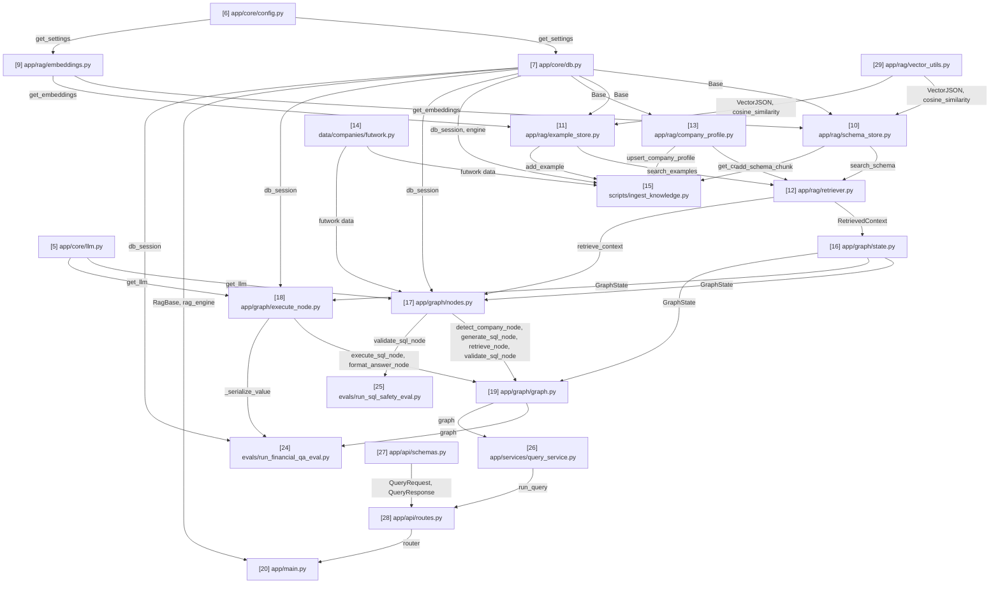

# rag-text-to-sql — Notes & Timeline

Short, plain notes on every file created, in the order it was created, plus two
graphs so the project's history and structure are visible at a glance.

## Timeline

Every file with real content or behavior, in strict creation order (includes
`.gitignore`, README, config files — everything except empty/near-empty
`__init__.py` package markers, which are pure Python plumbing with nothing to
study and are omitted here). Each node is numbered by creation order.

```
[1] .gitignore
     |
     v
[2] README.md
     |
     v
[3] requirements.txt
     |
     v
[4] .env
     |
     v
[5] app/core/llm.py
     |
     v
[6] app/core/config.py
     |
     v
[7] app/core/db.py
     |
     v
[8] app/core/cache.py (REMOVED post-build — Redis/caching deleted entirely,
     see its File notes entry below)
     |
     v
[9] app/rag/embeddings.py
     |
     v
[10] app/rag/schema_store.py
     |
     v
[11] app/rag/example_store.py
     |
     v
[12] app/rag/retriever.py
     |
     v
[13] app/rag/company_profile.py
     |
     v
[14] data/companies/futwork.py
     |
     v
[15] scripts/ingest_knowledge.py
     |
     v
[16] app/graph/state.py
     |
     v
[17] app/graph/nodes.py
     |
     v
[18] app/graph/execute_node.py
     |
     v
[19] app/graph/graph.py
     |
     v
[20] app/main.py (early/minimal test harness, built ahead of build order)
     |
     v
[21] evals/__init__.py
     |
     v
[22] evals/create_financial_qa_dataset.py
     |
     v
[23] evals/create_sql_safety_dataset.py
     |
     v
[24] evals/run_financial_qa_eval.py
     |
     v
[25] evals/run_sql_safety_eval.py
     |
     v
[26] app/services/query_service.py
     |
     v
[27] app/api/schemas.py
     |
     v
[28] app/api/routes.py  <-- BUILD COMPLETE (all 18 planned lessons done;
     lesson 18 only edited [20] app/main.py further, no new file — see its
     updated note below)
     |
     v
[29] app/rag/vector_utils.py (post-build, added when the RAG store moved
     off Neon/pgvector to a local SQLite file — see its own note)
     |
     v
[32] ARCHITECTURE.md (post-build, docs-only — reviews a hand-drawn diagram
     and adds a corrected Mermaid architecture diagram; no code, so no
     Routes Graph node)
```

## Routes Graph (import / dependency connections)

This is ONE single graph covering the whole project — never split into
multiple smaller diagrams scattered through this file. It is different from
the Timeline above: the Timeline shows every file with real content in
creation order, while the Routes Graph only shows files that actually contain
import-relevant logic — skip `.gitignore`, `.env`/config files, READMEs,
dependency manifests, and any `__init__.py` package-marker file — even one
that imports submodules for side effects (e.g. table registration), since
that's plumbing, not something a reader needs to trace to understand
file-to-file data flow.
Every arrow means "the file at the tail is imported by the file at the head,"
labeled with *what* it imports.

**The number in each node's label is its own sequence number within THIS
graph only — it does NOT match the Timeline number for the same file.** A
file might be the 6th file created overall (Timeline `[6]`) but only the 2nd
file that participates in the import graph (Routes Graph node `2`) — that's
exactly `app/core/config.py` below. Always state both numbers when
introducing a new Routes Graph node, to avoid confusing the two.

**This is a Mermaid diagram** (` ```mermaid `, `graph TD`) — GitHub and VS
Code render it automatically as an actual flowchart with boxes and arrows,
not raw text; hand-drawn ASCII arrows do not scale past a handful of nodes
and should not be used here. It is a living document: when a new file joins
the import graph, add its node and edges to this SAME diagram in place — do
not create a second Routes Graph elsewhere in this file, and do not leave
old now-superseded versions behind. Label each edge with what it imports
(e.g. `n2 -->|get_db| n6`) — this makes a separate connections list
unnecessary, since the labels carry that information directly.



## File notes

No analogies here — plain, factual logic and motive only (analogies belong in
chat and in CLAUDE.md, not here).

### [1] .gitignore
- Motive: Keep generated/environment files (`.venv/`, `__pycache__/`) and secrets
  (`.env`) out of version control from the very first commit.
- Logic: Standard Python ignore patterns — byte-compiled files, virtual
  environments, `.env*` (except `.env.example`/`.env.sample`), test/coverage
  caches, IDE and OS files.

### [2] README.md
- Motive: Give the repo a minimal landing page before any real code exists.
- Logic: Project title, one-paragraph description, and a placeholder Getting
  Started section with venv/install commands.

### [3] requirements.txt
- Motive: Placeholder dependency manifest so the project has a known place to
  track Python packages as they're added.
- Logic: Empty aside from a header comment; populated as each lesson adds a
  real dependency.

### [4] .env
- Motive: Hold real credentials (AWS Bedrock, Neon Postgres, Redis) locally,
  outside version control (git-ignored by `.gitignore` entry `[1]`).
- Logic: Empty at creation; populated by the user as each service's
  credentials are supplied during the build.

### [5] app/core/llm.py (Routes Graph node 1)
- Motive: Every module that needs to call the LLM (RAG retriever, LangGraph
  SQL-generation/validation nodes) should get its client the same way, from
  one place, so model/region/credential configuration lives in a single
  location instead of being duplicated.
- Logic: `_env()` reads and strips an environment variable with an optional
  default. `_env_float()` does the same and casts to `float`, treating unset
  or empty as "use default." `get_llm()` reads `BEDROCK_CHAT_MODEL_ID`,
  `BEDROCK_REGION` (falling back to `AWS_REGION`), and `AWS_PROFILE` from
  the environment, raises `ValueError` if model ID or region is missing,
  and returns a configured `ChatBedrockConverse` instance with
  `temperature` defaulting to `0` for deterministic SQL generation.
  `credentials_profile_name` is only passed when a profile is set, so the
  same code works with IAM-role-based credentials in a deployed environment.

### [6] app/core/config.py (Routes Graph node 2)
- Motive: Give the DB, cache, and embedding modules a single, typed,
  validated source of configuration instead of each reading raw env vars
  directly.
- Logic: `_env()`/`_env_int()` read and cast environment variables the same
  way as `llm.py`'s helpers. `Settings` is a frozen dataclass holding
  `database_url`, `redis_url`, `embedding_model_name`, `cache_ttl_seconds`.
  `get_settings()` reads `DATABASE_URL` and `REDIS_URL` (required, raises
  `ValueError` if missing), `EMBEDDING_MODEL_NAME` (defaults to
  `sentence-transformers/all-MiniLM-L6-v2`), and `CACHE_TTL_SECONDS`
  (defaults to `3600`), and is wrapped in `functools.lru_cache` so the
  environment is read and validated exactly once per process, with every
  caller sharing the same `Settings` instance. Imported by `app/core/db.py`,
  `app/core/cache.py`, and `app/rag/embeddings.py`.
  (Note: the embedding field/env-var was renamed from `embedding_model_id`/
  `BEDROCK_EMBEDDING_MODEL_ID` in lesson 5, when embeddings moved off Bedrock
  to a local open-source model — updated here to stay accurate.)
  **Corrected post-hoc, RAG store moved off Neon entirely**: `Settings`
  gained `rag_database_url`, read via `_env("RAG_DATABASE_URL",
  "sqlite:///./rag_store.db")` — optional, unlike `database_url`/
  `redis_url`, since it has a working default and nothing requires the
  user to configure it explicitly. Used by `app/core/db.py`'s new
  `rag_engine` (see that file's note).
  **Corrected post-hoc, Redis removed entirely**: `redis_url` and
  `cache_ttl_seconds` deleted from `Settings`, the `REDIS_URL`-missing
  `ValueError` check deleted, and `_env_int()` deleted along with them —
  it had no other caller. `Settings` is now just `database_url`,
  `embedding_model_name`, `rag_database_url`. No longer imported by
  `app/core/cache.py`, since that file no longer exists.

### [7] app/core/db.py (Routes Graph node 3)
- Motive: Give every part of the app that needs to read/write Neon Postgres
  (pgvector stores, SQL execution node, ingestion script) one shared engine
  and session factory, instead of each opening its own connection.
- Logic: `_to_psycopg_url()` rewrites a plain `postgresql://`/`postgres://`
  connection string to `postgresql+psycopg://` so SQLAlchemy loads the
  psycopg (v3) driver. `engine` is created from that URL with
  `pool_pre_ping=True` (needed because Neon can suspend idle connections;
  pre-ping verifies a pooled connection is alive before reuse).
  `SessionLocal` is a session factory with `autoflush`/`autocommit` off.
  `Base` is the empty `DeclarativeBase` subclass future ORM table models
  will inherit from. `init_pgvector_extension()` runs
  `CREATE EXTENSION IF NOT EXISTS vector` once, in its own transaction.
  `get_db()` is a generator-shaped FastAPI dependency (yields a session,
  closes it in `finally`). `db_session()` is a context manager for non-FastAPI
  code — commits on success, rolls back and re-raises on exception, always
  closes. Imports `get_settings` from `app/core/config.py` (Timeline `[6]`,
  Routes Graph node 2).
  **Corrected post-hoc** (lesson 12): `SessionLocal` also gained
  `expire_on_commit=False`. Without it, ORM objects returned from a
  `db_session()` block (e.g. the `SchemaChunk`/`FewShotExample` lists inside
  a `RetrievedContext`, returned by `app/graph/nodes.py`'s `retrieve_node()`)
  raised `DetachedInstanceError` the instant their attributes were accessed
  outside that session — discovered when `generate_sql_node()` tried to read
  `chunk.schema_name` after `retrieve_node()`'s session had already closed.
  **Corrected post-hoc, RAG store moved off Neon entirely**: at explicit
  user request, this file now manages *two* separate databases instead of
  one. Everything above (`engine`, `SessionLocal`, `Base`, `get_db()`,
  `db_session()`) is unchanged and still points at Neon — but `Base` no
  longer has any models registered on it, since all three RAG bookkeeping
  tables moved to the new SQLite side below; Neon's only remaining job is
  the real financial data table, queried with raw SQL, never the ORM.
  `init_pgvector_extension()` was deleted outright — nothing in the project
  uses pgvector anymore. New: `rag_engine` (`create_engine(settings.
  rag_database_url, connect_args={"check_same_thread": False})` — the
  `check_same_thread` override is needed because FastAPI runs sync
  endpoints in a threadpool, not necessarily the thread that opened the
  SQLite connection), `RagSessionLocal` (same shape as `SessionLocal`,
  `expire_on_commit=False` too, for the same detached-instance reason), a
  new empty `RagBase` for the RAG models to inherit from instead of `Base`,
  and `rag_db_session()` — a context manager identical in behavior to
  `db_session()`, just bound to `RagSessionLocal`. `rag_database_url`
  (from `app/core/config.py`, defaulting to `sqlite:///./rag_store.db`)
  is a local file path, not a network connection — no server to spin up,
  no credentials needed, which is the whole point of this move.

### [8] app/core/cache.py (Routes Graph node 4)
- Motive: Give `query_service.py` (and anything else that wants to cache
  something) a simple, reusable get/set interface over Redis, so it doesn't
  need to know about connection URLs, JSON encoding, or key hashing.
- Logic: `get_redis_client()` builds a single `redis.Redis` client from
  `settings.redis_url` (`decode_responses=True` so values come back as
  `str`), cached via `lru_cache` so the whole process shares one client.
  `make_cache_key(namespace, *parts)` strips/lowercases each part, joins
  them, and SHA-256 hashes the result into a fixed-length key prefixed with
  `namespace`, so near-identical inputs (case/whitespace differences) share
  a cache entry. `cache_get(key)` returns the JSON-decoded value or `None`
  on a miss. `cache_set(key, value, ttl=None)` JSON-encodes `value` and
  stores it with Redis's built-in expiry (`ex=`), defaulting to
  `settings.cache_ttl_seconds` if no explicit `ttl` is given. Imports
  `get_settings` from `app/core/config.py` (Timeline `[6]`, Routes Graph
  node 2).
  **[REMOVED, post-build]**: deleted entirely, at explicit user request
  ("we don't need caching anymore"). No replacement file — this whole
  module (and the cache-aside pattern it enabled in `query_service.py`)
  is simply gone. Routes Graph node 4 (this file) no longer appears in the
  live diagram above, nor does its `n2 -->|get_settings| n4` edge or its
  `n4 -->|cache_get, cache_set, make_cache_key| n19` edge into
  `query_service.py` — both removed rather than left pointing at a
  deleted file. `app/core/config.py` (Timeline `[6]`) lost the
  `redis_url`/`cache_ttl_seconds` fields this file depended on;
  `query_service.py` (Timeline `[26]`) lost its cache-check/cache-write
  logic; `routes.py` (Timeline `[28]`) lost the now-redundant
  `POST /query/no-cache` endpoint (with no cache, it would be identical to
  `/query`). Verified for real: server runs and `/query` answers correctly
  with Docker/Redis not even running.

### [9] app/rag/embeddings.py (Routes Graph node 5)
- Motive: The schema store, example store, and retriever all need to turn
  text into vectors the same way; centralizing that avoids each one loading
  its own copy of the embedding model into memory, and keeps the model
  swappable via config rather than hardcoded.
- Logic: `get_embeddings()` builds a LangChain `HuggingFaceEmbeddings`
  instance from `settings.embedding_model_name` (default
  `sentence-transformers/all-MiniLM-L6-v2`, an open-source model that runs
  fully locally on CPU, no API calls or credentials — chosen instead of a
  Bedrock embedding model per explicit decision to keep RAG embeddings
  open-source). Wrapped in `functools.lru_cache` since loading model
  weights is expensive and should happen once per process. Produces
  384-dimensional vectors, verified by a smoke test (`embed_query` returned
  a length-384 list). This dimension constrains the pgvector column type
  (`vector(384)`) in the schema/example stores built next. Imports
  `get_settings` from `app/core/config.py` (Timeline `[6]`, Routes Graph
  node 2).

### [10] app/rag/schema_store.py (Routes Graph node 6)
- Motive: There was no way to store or search financial schema knowledge
  (what a table/column means) before this. This gives RAG retrieval a real
  place to read from, and gives an ingestion process a real place to write
  to.
- Logic: `SchemaChunk` is an ORM model (table `schema_chunks`) with `company`,
  `schema_name`, `table_name`, an optional `column_name`, a `description`
  text field (the natural-language text that gets embedded), an `embedding`
  column of type `Vector(384)` (must match the embedding model's output
  dimension), and `is_per_entity` (`Boolean`, default `False` — see the
  lesson 12 correction below). `add_schema_chunk(db, company, schema_name,
  table_name, description, column_name=None, is_per_entity=False)` embeds
  `description` via `get_embeddings().embed_query()`, builds a `SchemaChunk`,
  and stages+flushes it (flush pushes the INSERT within the current
  transaction and populates the generated `id`, without committing — leaves
  commit/rollback timing to the caller). `search_schema(db, company, query,
  top_k=5, is_per_entity=None)` embeds `query`, then runs
  `SELECT ... WHERE company = :company [AND is_per_entity = :flag]
  ORDER BY embedding <=> :query_vector LIMIT top_k` via pgvector's
  `cosine_distance()` SQLAlchemy operator (the `is_per_entity` filter only
  applies when explicitly passed `True`/`False`, not `None`) — the actual
  distance computation runs inside Postgres, not in Python, and the
  `company` filter applies *before* similarity ordering so one company's
  data can never surface in another's retrieval. Imports `Base` from
  `app/core/db.py` (Timeline `[7]`, Routes Graph node 3) and
  `get_embeddings` from `app/rag/embeddings.py` (Timeline `[9]`, Routes
  Graph node 5).
  **Corrected post-hoc** (lesson 12, a genuine bug found via live testing,
  not a preference change): asking "what was the total revenue in March
  2026?" retrieved zero occurrences of `total_revenue` even at `top_k=15` —
  every slot was filled by one of the 55 near-identical
  `billing_amount_<client>` descriptions, which cluster so tightly in
  embedding space that they can completely crowd out a genuinely more
  relevant distinct metric. Added `is_per_entity` (`True` for the 110
  per-client `billing_amount_*`/`minutes_spoken_*` columns, `False` for the
  67 distinct metrics) so `retriever.py` (below) can query both pools
  independently and guarantee a distinct metric is never crowded out.
  Required dropping and recreating the (by then non-empty, 177-row) table —
  see `CLAUDE.md`'s Known gaps for why that's a real migrations gap, not
  just a lesson-6-era one.
  **History**: originally built without `company`/`schema_name` (verified
  end-to-end then: table created, `net_margin` correctly ranked above
  `revenue` for a profit-margin query, test rows removed). **Corrected
  post-hoc** once real Futwork data turned out to live in
  `portfolio.futwork_vs_aop` (not `public`) and multi-tenancy became a
  requirement — the (still-empty) table was dropped and recreated with the
  new columns, then re-verified: inserted a real `hitl` chunk for company
  `futwork`, confirmed `search_schema()` for a *different* company correctly
  returns `[]`, then removed the verification row.
  **Corrected post-hoc again**, at explicit user request: `SchemaChunk`
  gained `__table_args__ = {"schema": "rag"}` so the table lives at
  `rag.schema_chunks` instead of `public.schema_chunks` — grouping all
  three RAG bookkeeping tables under one dedicated schema, separate from
  Postgres's default `public`. Same drop/recreate/re-ingest cycle as
  before; re-verified retrieval and the live `/query` endpoint afterward.
  **Corrected post-hoc, moved off Neon entirely**: at explicit user
  request, all three RAG bookkeeping tables (this one included) moved from
  the Neon `rag` schema to a local SQLite file (`rag_store.db`, created
  automatically at server startup — see `app/main.py`'s note). Neon now
  holds only the real financial data table
  (`portfolio.futwork_vs_aop`) — queried directly with raw SQL, never
  through this ORM. Three changes here specifically: (1) `SchemaChunk` now
  subclasses `RagBase` (new, in `app/core/db.py`) instead of `Base`, and
  dropped `__table_args__ = {"schema": "rag"}` entirely — SQLite has no
  Postgres-style schema namespacing, and doesn't need one since the whole
  file is already dedicated to RAG bookkeeping; (2) `embedding` changed
  from pgvector's `Vector(384)` to a new `VectorJSON` type (in the new
  `app/rag/vector_utils.py`) — a `TypeDecorator` that JSON-encodes/decodes
  a `list[float]` into a `Text` column, since SQLite has no native vector
  type; (3) `search_schema()` no longer runs `ORDER BY embedding <=>
  :vector LIMIT top_k` in SQL (SQLite can't do that) — it now fetches every
  row matching the `company`/`is_per_entity` filters, ranks them in Python
  with a new `cosine_similarity()` helper (also in `vector_utils.py`,
  plain-Python dot-product/norm math, no new dependency), and slices the
  top `top_k` in-process. Fine at this data size (177 rows total for one
  company) — would need reconsidering if a company's schema knowledge grew
  into the tens of thousands of rows. Imports `RagBase` from
  `app/core/db.py` (Timeline `[7]`, Routes Graph node 3) instead of `Base`.
  **Verified for real**: deleted `rag_store.db`, started the server fresh
  (confirmed all three tables auto-created, empty), ran
  `scripts/ingest_knowledge.py` (177 chunks + 5 examples, matching the old
  Neon counts exactly), and a live `/query/no-cache` request correctly
  retrieved context and answered "What was the total revenue in June
  2026?" with the right INR figure — same result quality as before the
  move, now with zero pgvector/Neon involvement for retrieval.

### [11] app/rag/example_store.py (Routes Graph node 7)
- Motive: Give few-shot NL→SQL examples (question paired with the correct
  SQL for it) a real place to be stored and searched, the same way schema
  knowledge got one in lesson 6.
- Logic: `FewShotExample` is an ORM model (table `few_shot_examples`) with
  `company`, `question` (Text), `sql` (Text, the correct SQL for that
  question), and `embedding` (`Vector(384)`). Only `question` is embedded,
  never `sql` — retrieval is meant to find questions similar in *intent*,
  not SQL statements similar in shape. `add_example(db, company, question,
  sql)` embeds `question` and stages+flushes a new row. `search_examples(db,
  company, query, top_k=3)` embeds `query` and runs the same
  company-filtered, pgvector cosine-distance search as `search_schema()`,
  defaulting to fewer results (3 instead of 5) since few-shot prompts work
  best with a handful of examples. Imports `Base` from `app/core/db.py`
  (Timeline `[7]`, Routes Graph node 3) and `get_embeddings` from
  `app/rag/embeddings.py` (Timeline `[9]`, Routes Graph node 5).
  **History**: originally built without `company` (verified then: table
  created, profit-margin example correctly ranked first, test rows
  removed). **Corrected post-hoc** alongside `schema_store.py` for the same
  multi-tenancy reason — table dropped and recreated with the new column.
  **Corrected post-hoc again**, at explicit user request: also gained
  `__table_args__ = {"schema": "rag"}`, moving it to `rag.few_shot_examples`
  — see `schema_store.py`'s note above for the full rationale.
  **Corrected post-hoc, moved off Neon entirely**: same treatment as
  `schema_store.py` above — now subclasses `RagBase` (not `Base`), dropped
  `__table_args__`, `embedding` is `VectorJSON` instead of `Vector(384)`,
  and `search_examples()` ranks candidates in Python via
  `cosine_similarity()` instead of a pgvector `ORDER BY` clause. Lives in
  the same local `rag_store.db` SQLite file as the other two RAG tables.

### [12] app/rag/retriever.py (Routes Graph node 8)
- Motive: The SQL-generation node (built next in the `app/graph/` lessons)
  shouldn't need to know there are two separate stores with two separate
  searches — this file combines both into one call and one ready-to-use
  block of prompt text.
- Logic: `RetrievedContext` is a frozen dataclass holding `company_profile`
  (`str | None`), `schema_chunks`, and `examples`. Its `to_prompt_text()`
  method opens with a "Business context" section (the company's profile
  text, or `"(none found)"`), then formats each schema chunk as
  `"- schema.table.column: description"` (or `"- schema.table: description"`
  when there's no column — the schema-qualified form was added so the LLM
  writes `FROM portfolio.futwork_vs_aop`, not an unqualified/wrong-schema
  guess) and each example as `"Q: ...\nSQL: ..."`, falling back to
  `"(none found)"` for the schema/example sections too when nothing was
  retrieved. `retrieve_context(db, company, question, schema_top_k=5,
  per_entity_top_k=3, example_top_k=3)` fetches the company's profile via
  `get_company_profile()`, runs **two independent** `search_schema()` calls
  — one with `is_per_entity=False` (distinct metrics) and one with
  `is_per_entity=True` (per-client columns) — concatenates their results
  (distinct metrics first), and calls `search_examples()` for the same
  `company`/`question`, bundling all three into one `RetrievedContext`.
  Imports `get_company_profile` from `app/rag/company_profile.py` (Timeline
  `[13]`, Routes Graph node 9), `search_schema` from
  `app/rag/schema_store.py` (Timeline `[10]`, Routes Graph node 6), and
  `search_examples` from `app/rag/example_store.py` (Timeline `[11]`,
  Routes Graph node 7).
  **History**: originally built without `company`/business-context
  (verified then: empty-knowledge-base fallback text, then combined
  schema+example retrieval, test rows removed). **Corrected post-hoc**
  alongside the other multi-tenancy changes; re-verified with the real
  Futwork profile, a real `hitl` schema chunk, and a real example row —
  confirmed the full three-section prompt renders correctly and that a
  different company's `search_schema()` call returns `[]`.
  **Corrected again in lesson 12**: `retrieve_context()` originally made a
  single `search_schema()` call with no `is_per_entity` split — this was
  the actual site of the "`total_revenue` never appears" bug (see
  `schema_store.py`'s note above for the full diagnosis). Re-verified with
  the two-pool split: `total_revenue` now appears in the distinct-metrics
  pool, and per-client questions (e.g. "billing amount from BharatPe") still
  correctly surface the right per-entity column from its own pool.
  **Corrected again, eval-driven**: `schema_top_k` default raised from 5 to
  8 after `evals/run_financial_qa_eval.py` (Timeline `[24]`) showed a
  6-column AR-aging question could only ever retrieve 5 of the 6 needed
  columns under the old default — a capacity limit, not a ranking quality
  issue. Re-run confirmed both `execution_accuracy` and `retrieval_recall`
  hit 1.0 for that question after the fix.

### [13] app/rag/company_profile.py (Routes Graph node 9)
- Motive: Schema/example knowledge alone doesn't tell the LLM *how a
  company's numbers should be interpreted* (e.g. that HITL vs AI+Workflows
  is a revenue split, or that billing is output-based, not per-seat). This
  gives that business narrative a real home, scoped per company for when
  more companies are added later.
- Logic: `CompanyProfile` is an ORM model (table `company_profiles`) with
  `company` as the primary key and `profile` as a plain `Text` field — no
  embedding column, because there's only ever one row per company to fetch
  (an exact primary-key lookup), not "the most similar profile among many,"
  so vector search adds nothing here. `get_company_profile(db, company)`
  returns the row (or `None`) via `db.get()`. `upsert_company_profile(db,
  company, profile)` updates the existing row if one exists for that
  company, otherwise inserts a new one, staging+flushing either way.
  Imports `Base` from `app/core/db.py` (Timeline `[7]`, Routes Graph node
  3). Verified against the real Neon RAG branch: the confirmed Futwork
  business profile was stored for real (not test data — kept, unlike the
  schema/example verification rows), and a lookup for a nonexistent company
  correctly returned `None`.
  **Corrected post-hoc**, at explicit user request: also gained
  `__table_args__ = {"schema": "rag"}`, moving it to `rag.company_profiles`
  — see `schema_store.py`'s note (Timeline `[10]`) for the full rationale.
  The Futwork profile was re-upserted for real via re-running
  `ingest_knowledge.py` after the move.
  **Corrected post-hoc, moved off Neon entirely**: same treatment as the
  other two RAG tables — now subclasses `RagBase` instead of `Base`,
  dropped `__table_args__` (SQLite doesn't need a schema namespace here).
  No embedding column on this model to begin with, so no `VectorJSON`
  change was needed. Lives in the local `rag_store.db` SQLite file. The
  Futwork profile was re-upserted for real via re-running
  `ingest_knowledge.py` against the fresh SQLite store.

### [14] data/companies/futwork.py (Routes Graph node 10)
- Motive: Separates *data* (what the 67 metrics mean, the per-client
  templates, the business profile, the few-shot examples) from *logic*
  (how to turn that data into database rows) — keeps the ingestion script
  reusable for a future second company's data module.
- Logic: Pure data, no functions. `COMPANY`, `SCHEMA_NAME`, `TABLE_NAME`
  identify which company/view this module describes. `PROFILE` is the
  confirmed Futwork business narrative. `EXCLUDED_COLUMNS` lists dimension/
  key columns that never become schema chunks (`id`, `file_path`,
  `month_name`, `year`). `PER_CLIENT_TEMPLATES` holds the 2 confirmed
  templates (`billing_amount`, `minutes_spoken`) with a `{client}`
  placeholder. `METRIC_DESCRIPTIONS` maps all 67 confirmed distinct column
  names to their plain-English descriptions. `FEW_SHOT_EXAMPLES` is a list
  of 5 confirmed `(question, sql)` pairs, deliberately avoiding "most
  recent month" style queries since `month_name` is text and sorts
  alphabetically, not chronologically.
  **Corrected post-hoc in lesson 13**: all 5 examples originally used
  capitalized month names (`'March'`) in their SQL. The real data stores
  `month_name` lowercase (`'march'`) — Postgres string comparison is
  case-sensitive, so every example's SQL silently matched zero rows despite
  being otherwise correct. Fixed to lowercase and re-ingested; see
  `nodes.py`'s note below for the matching system-prompt fix.
  **Corrected post-hoc, company/table-routing redesign**: added `TABLES`, a
  list of `{schema, table, description}` dicts (currently one entry, built
  from the existing `SCHEMA_NAME`/`TABLE_NAME`). `SCHEMA_NAME`/`TABLE_NAME`
  themselves are unchanged and still used by `ingest_knowledge.py` for
  column introspection — `TABLES` is a separate, query-time registry read
  by `nodes.py` so the LLM (not Python) picks which table to query. See
  `nodes.py`'s matching note below.

### [15] scripts/ingest_knowledge.py (Routes Graph node 11)
- Motive: Turns the data in `futwork.py` into real rows in all three RAG
  tables — the one piece of code that actually populates the knowledge
  base, rather than just being capable of holding it.
- Logic: `_PER_CLIENT_PATTERN` is a regex built from
  `PER_CLIENT_TEMPLATES`'s own keys (e.g.
  `^(billing_amount|minutes_spoken)_(.+)$`), so adding a new template
  automatically extends the pattern. `_describe_column(column_name)`
  returns a `(description, is_per_entity)` tuple: matches a column against
  that pattern first (filling `{client}` from the captured group, returning
  `is_per_entity=True`), falling back to an exact `METRIC_DESCRIPTIONS`
  lookup (`is_per_entity=False`); returns `None` if neither matches.
  `ingest()` introspects the *real* columns of `portfolio.futwork_vs_aop`
  via `sqlalchemy.inspect()` (not a hardcoded list — a new client column
  added later is picked up automatically), deletes this company's existing
  `schema_chunks`/`few_shot_examples` rows first (making the script
  idempotent/re-runnable as descriptions change), upserts the company
  profile, then loops every real column: skips `EXCLUDED_COLUMNS`, calls
  `_describe_column()`, and either inserts a `SchemaChunk` (passing through
  `is_per_entity`) or records the column name as skipped (an unknown column
  is surfaced via a warning, never silently guessed). Finally seeds the 5
  `FEW_SHOT_EXAMPLES`. Imports `db_session`/`engine` from `app/core/db.py`
  (Timeline `[7]`, Routes Graph node 3), `add_schema_chunk` from
  `app/rag/schema_store.py` (Timeline `[10]`, Routes Graph node 6),
  `add_example` from `app/rag/example_store.py` (Timeline `[11]`, Routes
  Graph node 7), `upsert_company_profile` from `app/rag/company_profile.py`
  (Timeline `[13]`, Routes Graph node 9), and the data itself from
  `data/companies/futwork.py` (Timeline `[14]`, Routes Graph node 10).
  **Verified for real** against the Neon RAG branch: ingested 177 schema
  chunks (67 metrics + 55 clients × 2 templates) and 5 examples for
  `futwork`, zero columns skipped/unknown. Spot-checked retrieval quality
  on 3 real questions afterward via `retrieve_context()` — all returned
  sensible top matches (e.g. "revenue per minute for Amazon" correctly
  surfaced both `billing_amount_amazon` and `minutes_spoken_amazon`).
  **Corrected post-hoc in lesson 12**: `_describe_column()` originally
  returned just a description string, with no `is_per_entity` signal — this
  script was updated (and the whole table re-ingested from scratch) as part
  of the retrieval-crowding-out bug fix documented in `schema_store.py`'s
  and `retriever.py`'s notes above.
  **Corrected post-hoc, RAG store moved off Neon entirely**: `db_session`
  import replaced with `rag_db_session` — every write (`delete()`,
  `upsert_company_profile()`, `add_schema_chunk()`, `add_example()`) now
  targets the local SQLite file instead of Neon. `engine` (Neon) is still
  imported and still used for `inspect(engine)`'s column introspection —
  that part is unchanged, since the real column list still lives in
  Neon's `portfolio.futwork_vs_aop`; only the *bookkeeping* about those
  columns moved. Also added one line at the top of `ingest()`:
  `RagBase.metadata.create_all(rag_engine)` — this script can now run
  standalone against a brand-new machine with no `rag_store.db` yet
  (previously the tables only got created by `app/main.py`'s lifespan
  hook, so running this script before ever starting the server failed
  with `no such table: schema_chunks`). **Verified for real**: deleted
  `rag_store.db`, ran this script directly (no server started first) —
  it created the file and all three tables itself, then ingested 177
  schema chunks + 5 examples, exactly matching the old Neon-era counts.
- Motive: Every LangGraph node in this workflow reads from and writes to
  one shared object rather than calling each other directly. Without a
  single agreed-upon shape for that object, a typo in one node's dict key
  would fail silently at runtime instead of being caught upfront.
- Logic: `GraphState` is a single `TypedDict` covering the whole pipeline:
  `question` is the only required field (supplied by whoever starts the
  graph); `company`/`company_detection_error` (set by the detect-company
  node — see the correction note below), `retrieved_context` (set by the retrieve node),
  `generated_sql`/`validation_error`/`retry_count` (set by the generate/
  validate nodes — `validation_error` drives a conditional retry edge, and
  `retry_count` caps how many retries are allowed), `sql_result`/
  `execution_error` (set by the execute node), and `final_answer` (set by
  the format node) are all `NotRequired` (standard-library `typing`,
  Python 3.11+) since they're populated progressively as the graph runs,
  not known up front. Imports `RetrievedContext` from
  `app/rag/retriever.py` (Timeline `[12]`, Routes Graph node 8). Verified
  by constructing a minimal `GraphState` with only `company`/`question`
  set, confirming the `NotRequired` fields are genuinely optional.
  **Corrected post-hoc, company auto-detection**: `company` moved from a
  required field to `NotRequired`, since it's no longer supplied by the
  API caller — it's derived from `question` by the new `detect_company`
  node (see `nodes.py`/`graph.py` notes below) and only exists in state
  once that node has run. Added `company_detection_error` alongside it —
  `None` on a successful match, a message otherwise — so the graph can
  short-circuit to `END` before ever reaching `retrieve`/`generate`
  (which assume `company` is set) when detection fails.

### [17] app/graph/nodes.py (Routes Graph node 13)
- Motive: This is where the pipeline's actual intelligence lives — turning
  retrieved context into a candidate SQL query and checking it's safe
  before anything touches the real database.
- Logic: `_COMPANY_DATA` is a small dict mapping a company string to its
  data module (currently just `{"futwork": futwork}`) — a minimal registry,
  not a plugin system, since there's one company today.
  `_strip_code_fences()` defensively removes markdown code fences an LLM
  might wrap SQL in despite being told not to. `retrieve_node(state)` opens
  a `rag_db_session()` (**corrected post-hoc**, was `db_session()` — the
  RAG bookkeeping tables `retrieve_context()` reads from moved off Neon to
  a local SQLite file, see `app/core/db.py`'s note; this node's own logic
  is otherwise unchanged), calls `retrieve_context()`, and returns
  `{"retrieved_context": ...}` for LangGraph to merge into state.
  `generate_sql_node(state)` builds a system prompt listing every table in
  this company's `TABLES` registry (schema + table + one-line description
  each, read dynamically from its data module) and tells the LLM to pick
  whichever one actually matches the question — Python never picks the
  table itself, it only supplies the allowed set — plus the retrieved
  context and question, appends the previous validation error to the
  prompt on a retry (so the LLM can self-correct), calls `get_llm()`, and
  strips code fences from the response. `validate_sql_node(state)` rejects
  anything that isn't a `SELECT`, rejects a fixed list of forbidden
  keywords (`INSERT`/`UPDATE`/`DELETE`/`DROP`/etc., via `\b`-bounded regex
  so `DROPDOWN` doesn't false-positive on `DROP`), and rejects SQL that
  doesn't reference *any* table in the company's `TABLES` list (checked via
  `_table_in_sql()` against every entry, not one fixed string) — each failure sets
  `validation_error` and increments `retry_count`, but the actual
  retry-vs-proceed *decision* belongs to `graph.py` (lesson 14), not this
  node. Imports `get_llm` from `app/core/llm.py` (Timeline `[5]`, Routes
  Graph node 1), `db_session` from `app/core/db.py` (Timeline `[7]`, Routes
  Graph node 3), `retrieve_context` from `app/rag/retriever.py` (Timeline
  `[12]`, Routes Graph node 8), `futwork` data from
  `data/companies/futwork.py` (Timeline `[14]`, Routes Graph node 10), and
  `GraphState` from `app/graph/state.py` (Timeline `[16]`).
  **Corrected post-hoc in lesson 13**: `generate_sql_node`'s system prompt
  gained an explicit instruction that `month_name` filters must use
  lowercase full month names — added after live testing showed the LLM
  (and the few-shot examples themselves) defaulting to capitalized month
  names, which silently matched zero rows against the real, lowercase data.
  **Verified for real** against Bedrock + Neon: the full retrieve → generate
  → validate chain produced correct, validated SQL for multiple real
  questions (total revenue, per-client billing, caller churn, runway) after
  the retrieval-crowding-out bug (documented in `schema_store.py`'s and
  `retriever.py`'s notes) was found and fixed via this same testing.
  **Corrected post-hoc, company/table-routing redesign**: `generate_sql_node`
  and `validate_sql_node` previously computed a single `allowed_table`
  string (`f"{company_data.SCHEMA_NAME}.{company_data.TABLE_NAME}"`) and
  either told the LLM to use exactly that table or rejected SQL that didn't
  contain it — the table choice was made in Python, not by the LLM, and the
  design assumed exactly one table per company. Replaced with
  `_format_allowed_tables()` (renders the company's `TABLES` list as
  markdown-ish bullet lines for the prompt) and `_table_in_sql()` (checks
  one table dict against the SQL string); `generate_sql_node` now shows the
  LLM the whole list and asks it to choose, and `validate_sql_node` accepts
  SQL referencing *any* entry in that list. `_COMPANY_DATA` is unchanged —
  it still decides which companies exist at all (a `KeyError` on an unknown
  company is unaffected); this redesign only changes how table selection
  works *within* one already-known company. Verified locally first, by
  exercising `_get_company_data()`/`_format_allowed_tables()`/
  `_table_in_sql()` directly: correct SQL against `portfolio.futwork_vs_aop`
  matches, SQL against an unrelated table doesn't, and an unknown company
  still raises `KeyError`. **Then verified for real** via
  `POST /query/no-cache` against live Bedrock + Neon: "What was the total
  revenue in March 2026?" → the LLM, given the `TABLES` list instead of a
  single dictated table string, picked `portfolio.futwork_vs_aop` itself
  and generated valid SQL against it on the first try (no validation
  retry), with the correct answer.
  **Corrected post-hoc, company auto-detection**: added
  `detect_company_node(state)` and a `_format_known_companies()` helper.
  Previously the caller had to pass `company` explicitly in every request;
  now the pipeline itself figures out which company a question is about.
  `_format_known_companies()` iterates `_COMPANY_DATA` and renders each
  company's key plus the first sentence of its `PROFILE` as one bullet
  line — the same registry `_get_company_data()` already used, reused here
  rather than a second list to keep in sync. `detect_company_node` puts
  that list in a system prompt, asks the LLM to reply with only the
  matching company key (or the literal string `UNKNOWN`), and normalizes
  the response (`.strip().strip(".\"'").lower()`) before checking it
  against `_COMPANY_DATA`. A match sets `{"company": ..., "company_detection_error":
  None}`; anything else — including `UNKNOWN` or a hallucinated key not in
  the registry — sets `company_detection_error` instead of guessing, and
  never sets `company` at all. This runs *before* `retrieve_node`/
  `generate_sql_node`/`validate_sql_node`, all of which still read
  `state["company"]` directly and are otherwise unchanged — they simply
  never run when detection fails, because `graph.py`'s new conditional
  edge routes straight to `END` in that case (see its note below).
  **Verified for real** against live Bedrock: "tell me the revenue of the
  futwork for june 2026" correctly detected `company="futwork"` with no
  company field in the request at all, and a question naming an unrecognized
  company ("acme corp") correctly came back as `company_detection_error`
  set (surfaced as a `404` by `routes.py`) rather than a crash or a guess.

### [18] app/graph/execute_node.py (Routes Graph node 14)
- Motive: Validated SQL still has to actually run against Neon, and raw
  rows still have to become a plain-English answer — these are the two
  remaining stages of the pipeline.
- Logic: `_apply_row_limit(sql, limit=500)` strips a trailing `;` and, if
  the SQL has no `LIMIT` already, wraps it as
  `SELECT * FROM (<sql>) AS limited_query LIMIT 500` so an unbounded query
  can't return an unbounded result. `_serialize_value()` converts `Decimal`
  (from `NUMERIC` columns) to `float` and `date`/`datetime` to ISO strings,
  since raw DB types aren't JSON-safe — originally because `cache_set()`
  (lesson 4) needed to JSON-encode this data; that reason is gone now that
  Redis/caching was removed entirely (see `cache.py`'s note), but the
  serialization is still needed regardless, since `QueryResponse`
  (`api/schemas.py`) still returns these values straight over HTTP.
  `execute_sql_node(state)` first refuses to
  run if `state["validation_error"]` is still set (defense in depth against
  a future routing bug in `graph.py`, not just trusting upstream wiring),
  then opens a `db_session()`, sets a 10-second `SET LOCAL
  statement_timeout` (from the "safely execute AI-generated SQL" article),
  executes the row-limited SQL, and returns serialized rows or an
  `execution_error` string on any exception — never lets a bad query crash
  the whole graph. `format_answer_node(state)` returns a canned message on
  `execution_error` or an empty result set without calling the LLM at all;
  otherwise it prompts the LLM with the question, the JSON rows, and the
  company's business-context text, asking it to narrate the numbers in
  plain English using the correct currency/units — explicitly not assuming
  USD or any default. Imports `get_llm` from `app/core/llm.py` (Timeline
  `[5]`, Routes Graph node 1), `db_session` from `app/core/db.py` (Timeline
  `[7]`, Routes Graph node 3), and `GraphState` from `app/graph/state.py`
  (Timeline `[16]`).
  **Corrected post-hoc, same lesson**: `format_answer_node()` originally
  had no business-context text in its prompt at all — live testing showed
  it defaulting to USD ("$22,063,632") for data that's actually INR, since
  nothing in the raw numbers said otherwise. Fixed by passing
  `state["retrieved_context"].company_profile` into the prompt.
  **Verified for real**: the full 5-stage pipeline (retrieve → generate →
  validate → execute → format) correctly answered "What was the total
  revenue in March 2026?" with "The total revenue for Futwork in March 2026
  was INR 22,063,632." — a real number from a real row. Also verified both
  error paths directly: the validation-error guard refuses to execute, and
  a genuine execution error (nonexistent column) is caught and surfaced as
  a plain-English message rather than crashing.

### [19] app/graph/graph.py (Routes Graph node 15)
- Motive: The five node functions were each independently correct, but
  nothing connected them into an actual workflow or decided what happens
  when validation fails — this file is the wiring and the one real
  decision point in the whole pipeline.
- Logic: `_route_after_validation(state)` is a LangGraph conditional-edge
  function — returns `"generate"` if `validation_error` is set and
  `retry_count < _MAX_RETRIES` (2), else `"execute"`. `build_graph()`
  constructs `StateGraph(GraphState)`, registers all 5 nodes under string
  names (`retrieve`, `generate`, `validate`, `execute`, `format`), wires
  the fixed path `START → retrieve → generate → validate` and
  `execute → format → END` via `add_edge()`, and wires the one variable
  path via `add_conditional_edges("validate", _route_after_validation,
  {"generate": "generate", "execute": "execute"})` — this is what makes a
  validate → generate → validate retry loop possible. `.compile()` turns
  the definition into a runnable object; the module-level `graph =
  build_graph()` is what `query_service.py` (lesson 15) will call
  `.invoke()` on directly. Imports `GraphState` from `app/graph/state.py`
  (Timeline `[16]`), `retrieve_node`/`generate_sql_node`/`validate_sql_node`
  from `app/graph/nodes.py` (Timeline `[17]`, Routes Graph node 13), and
  `execute_sql_node`/`format_answer_node` from `app/graph/execute_node.py`
  (Timeline `[18]`, Routes Graph node 14).
  **Verified for real**: `graph.invoke({"company": "futwork", "question":
  "What was the total revenue in March 2026?"})` correctly returned "The
  total revenue for Futwork in March 2026 was INR 22,063,632." through a
  single call — no manual node chaining needed, confirming the wiring
  itself (not just the individual nodes) works. `_route_after_validation()`
  also tested directly at all four boundary conditions: no error → execute;
  error with retries remaining → generate; error with retries exhausted →
  execute (where `execute_sql_node`'s defense-in-depth guard from lesson 13
  catches it and reports failure cleanly instead of running bad SQL).
  **Corrected post-hoc, company auto-detection**: added
  `_route_after_detect_company(state)` (returns `"end"` if
  `company_detection_error` is set, else `"retrieve"`) and a new
  `detect_company` node, registered first in the graph. The fixed path is
  now `START → detect_company`, then a conditional edge
  (`add_conditional_edges("detect_company", _route_after_detect_company,
  {"retrieve": "retrieve", "end": END})`) into the rest of the previously-fixed
  chain (`retrieve → generate → validate → ... → execute → format → END`),
  which is otherwise unchanged. This means a request that doesn't name a
  known company now ends the graph immediately after one LLM call, rather
  than reaching `retrieve_node` and raising a `KeyError` on
  `state["company"]`. Imports `detect_company_node` alongside the other
  three from `app/graph/nodes.py`. **Verified for real**:
  `graph.invoke({"question": "tell me the revenue of the futwork for june
  2026"})` — no `company` key in the input at all — correctly detected
  `futwork` and returned the right answer; a question naming an unknown
  company correctly stopped at `detect_company` with
  `company_detection_error` set and no further nodes run.

### [20] app/main.py (Routes Graph node 16)
- Motive: Built out of build-order sequence at lesson 12, at explicit user
  request, to manually test the compiled graph over real HTTP before the
  proper caching/schema/routing/startup layers existed — then completed in
  place across lessons 15-18 rather than rewritten from scratch. **As of
  lesson 18, this is the real, finished file.**
- Logic: A `FastAPI` app with one `POST /query` endpoint that maps the
  result dict onto `QueryResponse`.
  **Verified for real**: started with `uvicorn app.main:app`, a live
  `curl POST /query` for "What was the total revenue in March 2026?"
  correctly returned `sql_result: [{"total_revenue": 22063632}]` and
  `final_answer: "The total revenue for Futwork in March 2026 was INR
  22,063,632."` over actual HTTP.
  **Corrected post-hoc in lesson 15**: originally called
  `graph.invoke({"company": ..., "question": ...})` directly (no caching,
  since `query_service.py` didn't exist yet). Now calls `run_query()`
  instead, so the test harness actually exercises Redis caching. Imports
  `run_query` from `app/services/query_service.py` (Timeline `[26]`, Routes
  Graph node 19) — the direct import of `graph` from `app/graph/graph.py`
  was removed.
  **Corrected post-hoc in lesson 16**: `QueryRequest`/`QueryResponse` were
  originally defined inline in this file — moved to `app/api/schemas.py`
  (below) and imported from there instead, so the API's actual validation
  rules live in one dedicated place. Re-verified live: a blank question
  now returns a clean `422`, a valid one still returns `200`.
  **Corrected post-hoc in lesson 17**: the `@app.post("/query")` endpoint
  itself moved out to `app/api/routes.py` — this file now just
  instantiates `FastAPI` and calls `app.include_router(router)`. The
  direct imports of `run_query`/`QueryRequest`/`QueryResponse` were
  removed; the only remaining import is `router` from `app/api/routes.py`
  (Timeline `[28]`, Routes Graph node 21).
  **Completed in lesson 18 (the last planned lesson)**: added a `lifespan`
  async context manager — the modern FastAPI startup-hook pattern, not the
  soft-deprecated `@app.on_event("startup")` style — that runs
  `init_pgvector_extension()` and `Base.metadata.create_all(engine)` once
  at app boot, passed to `FastAPI(lifespan=lifespan)`. An explicit
  `import app.rag` right before it guarantees `SchemaChunk`/
  `FewShotExample`/`CompanyProfile` are registered on `Base.metadata`
  before `create_all()` runs, without depending on some other import chain
  happening to touch those modules first. Imports `Base`, `engine`,
  `init_pgvector_extension` from `app/core/db.py` (Timeline `[7]`, Routes
  Graph node 3).
  **Verified for real**: server restarted cleanly ("Application startup
  complete"), row counts in `rag.schema_chunks`/`rag.few_shot_examples`/
  `rag.company_profiles` were unchanged after restart (177/5/1 —
  `create_all()` only creates tables that don't exist, never touches ones
  that do), and `/query` still returned a correct real answer afterward.
  **Corrected post-hoc, RAG store moved off Neon entirely**: the lifespan
  hook now runs `RagBase.metadata.create_all(rag_engine)` instead of
  `init_pgvector_extension()` + `Base.metadata.create_all(engine)` —
  `init_pgvector_extension()` was deleted from `db.py` entirely (nothing
  uses pgvector anymore), and `Base`/`engine` (Neon) no longer have any
  ORM models registered on them to create in the first place. Imports
  `RagBase`/`rag_engine` from `app/core/db.py` instead of `Base`/`engine`.
  **Verified for real**: deleted `rag_store.db`, started the server with
  no file present at all — it created `rag_store.db` and all three tables
  (`schema_chunks`, `few_shot_examples`, `company_profiles`) automatically
  on first boot, exactly as intended ("these tables should be created
  using SQLite during runtime, on the local machine, the first time the
  server starts"). Re-ran `scripts/ingest_knowledge.py` afterward and
  confirmed a live `/query/no-cache` request still worked end-to-end.

### [27] app/api/schemas.py (Routes Graph node 20)
- Motive: The request/response contract for the API deserves its own file
  with real validation — not inline models in `main.py` that only checked
  "is this a string."
- Logic: `QueryRequest` has `company` (`Field(..., min_length=1,
  max_length=64)`) and `question` (`Field(..., min_length=1,
  max_length=500)`). A `field_validator` applied to both fields at once
  strips whitespace and raises if the result is blank — closes a gap
  `min_length` alone leaves open, since Pydantic's `min_length` counts the
  *unstripped* string, so `"   "` would otherwise pass a bare
  `min_length=1` check. `QueryResponse` is unchanged from what used to live
  in `main.py` — the same 5 fields (`generated_sql`, `sql_result`,
  `final_answer`, `validation_error`, `execution_error`). Deliberately does
  **not** validate that `company` is a company the pipeline actually knows
  about (currently just `"futwork"`) — that's business logic for the route
  handler (lesson 17), not a shape concern; confirmed this gap is real by
  sending an unknown company and getting a raw unhandled `500`, logged in
  `CLAUDE.md`'s Known gaps (now fixed — see `app/api/routes.py`'s note
  below). Imported by `app/api/routes.py` (Timeline `[28]`, Routes Graph
  node 21) — no longer imported directly by `app/main.py`.
  **Corrected post-hoc, company auto-detection**: `QueryRequest` dropped
  `company` entirely — a request is now just `{"question": "..."}`, since
  the pipeline detects the company itself (see `nodes.py`'s
  `detect_company_node` note). `QueryResponse` gained `company: str | None`
  and `company_detection_error: str | None`, both defaulting to `None`, so
  the caller can see which company was detected (or why detection failed)
  without a separate lookup.

### [28] app/api/routes.py (Routes Graph node 21)
- Motive: Separates "what the `/query` endpoint does" from "how the
  FastAPI app is wired together" — and is the natural place to fix the
  unknown-company gap, since that's a business-logic concern for a route
  handler, not something `schemas.py`'s shape validation should own.
- Logic: `router = APIRouter()` — a group of routes that doesn't need a
  `FastAPI` app instance to exist yet; gets attached later via
  `include_router()`. The `POST /query` handler wraps `run_query()` in
  `try`/`except KeyError`, raising `HTTPException(status_code=404,
  detail=f"Unknown company: {request.company!r}")` on failure — the
  `KeyError` actually originates one level down, inside
  `generate_sql_node`'s `_get_company_data()` dict lookup (`retrieve_node`
  doesn't fail for an unknown company; `get_company_profile()`/
  `search_schema()`/`search_examples()` all degrade gracefully to empty
  results instead of raising). Imports `QueryRequest`/`QueryResponse` from
  `app/api/schemas.py` (Timeline `[27]`, Routes Graph node 20) and
  `run_query` from `app/services/query_service.py` (Timeline `[26]`,
  Routes Graph node 19). Imported by `app/main.py` (Timeline `[20]`,
  Routes Graph node 16), which now just does
  `app.include_router(router)` instead of defining the endpoint itself.
  **Honest tradeoff**: catching bare `KeyError` is a little broad — some
  unrelated bug could theoretically also raise one in this call path and
  get misreported as "unknown company." A more precise fix would expose a
  dedicated `is_known_company()` check from `nodes.py`'s registry and
  validate before calling the graph at all — logged as a smaller open gap
  in `CLAUDE.md`.
  **Verified for real, twice** (once, then again after `app/main.py`
  reverted on disk and had to be restored): unknown company → `404`,
  blank question → `422`, valid question → `200` with the correct answer
  — all three paths through the real router, over live HTTP.
  **Verified for real**, both directly (6 test cases: valid input,
  blank/whitespace-only question, blank company, over-length question, and
  whitespace-trimming — all behaved correctly) and over live HTTP (blank
  question → `422` with a useful message; valid question → `200` with the
  correct answer).
  **Added post-build**, at explicit user request: `POST /query/no-cache` —
  identical shape and `KeyError`→`404` handling to `/query`, but calls
  `run_query_no_cache()` instead of `run_query()`. Also imports
  `run_query_no_cache` from `app/services/query_service.py` (Timeline
  `[26]`, Routes Graph node 19) alongside the existing `run_query` import.
  **Verified for real**: two identical requests both took full pipeline
  latency with no cache-hit speedup on the second call, a direct
  `cache_get()` check confirmed no cache entry was ever written for that
  question, and the unknown-company `404` handling was confirmed on this
  endpoint too.
  **Corrected post-hoc, company auto-detection**: both handlers dropped
  `request.company` — they now call `run_query(request.question)` /
  `run_query_no_cache(request.question)` with no company argument. The
  `try`/`except KeyError` wrapper is gone too, since `_get_company_data()`
  can no longer receive an unrecognized company (`detect_company_node`
  guarantees `company` is only ever set to a key already in
  `_COMPANY_DATA`, or not set at all). Detection failure is now surfaced
  as a plain state field instead of an exception: both handlers check
  `result["company_detection_error"]` and raise the same
  `HTTPException(status_code=404, ...)` as before if it's set, using the
  message the graph produced instead of a hardcoded one. This closes the
  "bare `KeyError` is a little broad" gap noted above by construction —
  there's no longer a `KeyError` in this call path to be ambiguous about.
  **Verified for real**: `POST /query/no-cache` with only `{"question":
  "tell me the revenue of the futwork for june 2026"}` (no `company` key)
  returned `200` with `company: "futwork"` correctly detected; the same
  endpoint with a question naming an unrecognized company returned a clean
  `404` with the detection-failure message.
  **Corrected post-hoc, Redis removed entirely**: `POST /query/no-cache`
  deleted outright, along with the `run_query_no_cache` import — once
  there's no cache anywhere in the app, a "skip the cache" endpoint is
  identical to the regular one, so keeping both would just be dead
  duplication. This file is back down to the single `POST /query` handler
  it started with. **Verified for real**: `POST /query/no-cache` now
  correctly 404s (FastAPI's default for an undefined route), and `/query`
  still returns correct answers with Docker/Redis not running.

### [21] evals/__init__.py
- Motive: Marks `evals/` as a Python package for eval-related scripts
  (dataset setup now; eval-running/scoring logic later).
- Logic: Empty file.

### [22] evals/create_financial_qa_dataset.py
- Motive: Powers three planned evals (execution accuracy, retrieval recall,
  answer groundedness) that all need the same reference data — a question
  paired with its correct SQL — kept as a separate LangSmith dataset from
  `data/companies/futwork.py`'s few-shot examples so the eval never
  trivially matches an identical question.
- Logic: No internal project imports — only `dotenv` and `langsmith`, so
  this file has no Routes Graph edges (nothing to show; it neither imports
  nor is imported by any other project file). `EXAMPLES` is a list of 7
  `{question, expected_sql, expected_columns}` dicts, covering the distinct-
  metric pool, per-entity columns, and a multi-column query, all against
  real months confirmed to exist in the data (March-June 2026).
  `sync_dataset()` gets-or-creates the `financial-qa-eval-futwork` LangSmith
  dataset, then diffs `EXAMPLES` against the dataset's *actual current
  content* — matched by each example's `question` text — to compute
  `to_create`/`to_update`/`to_delete`, and applies exactly that diff via
  `create_examples()`/`update_examples()`/`delete_examples(...,
  hard_delete=True)`.
  **Important discovery, found via live testing**: an earlier version of
  this script generated a deterministic UUID per example (hashing the
  question text) so it could pass an explicit `id` to `create_examples()`
  and treat that as an upsert key. This does not work — LangSmith
  permanently reserves an example ID once assigned, even after a hard
  delete, so recreating an example with that same ID throws `409 Conflict`.
  Also, `delete_examples()` defaults to a *soft* delete (`hard_delete=False`)
  that hides the example from `list_examples()` without freeing its ID.
  Rewritten to match by actual content instead of a synthetic ID, and to
  always pass `hard_delete=True`.
  **Verified for real** against the live LangSmith API: initial creation
  (7 created), a true no-op re-run (0/0/0), a genuine content change
  correctly detected as 1 update (and reverting it detected as another
  update), and the delete → recreate-with-identical-content cycle — the
  exact case that broke the UUID-based design — now succeeds cleanly.

### [23] evals/create_sql_safety_dataset.py
- Motive: Powers the SQL-safety eval — confirms `validate_sql_node`
  reliably rejects adversarial SQL. Kept as a separate dataset from the
  financial-QA one since its examples and success criteria are a
  fundamentally different kind of thing ("was this correctly rejected?"
  vs. "is this answer correct?").
- Logic: Same shape and same content-based matching as
  `create_financial_qa_dataset.py` (matched by `candidate_sql` text
  instead of `question`), and the same "no internal project imports, no
  Routes Graph edges" note applies. `EXAMPLES` is a list of 10 adversarial
  `candidate_sql` strings covering every forbidden keyword
  `validate_sql_node` checks for (`DROP`/`DELETE`/`UPDATE`/`INSERT`/
  `ALTER`/`TRUNCATE`/`GRANT`), two wrong-table references
  (`pg_catalog.pg_tables`, `information_schema.tables`), and one
  statement-chaining injection attempt. Each example's `outputs` is just
  `{"should_be_rejected": True}` — consumed by `run_sql_safety_eval.py`
  (below), which feeds `candidate_sql` into `validate_sql_node` and checks
  `validation_error` came back non-`None`.
  **Verified for real**: same create → no-op re-run → update/delete/
  recreate cycle as the financial-QA script, all passing cleanly.

### [24] evals/run_financial_qa_eval.py (Routes Graph node 17)
- Motive: The datasets alone don't test anything — this is the actual
  experiment: run the full pipeline against every question in
  `financial-qa-eval-futwork` and score it three different ways.
- Logic: `run_pipeline(inputs)` is the LangSmith "target function" —
  calls `graph.invoke()` and returns `generated_sql`, `retrieved_columns`
  (extracted from `retrieved_context.schema_chunks`), `sql_result`, and
  `final_answer`. Three evaluator functions, each declaring only the
  parameter names it needs (`outputs`, `reference_outputs` — LangSmith
  introspects the function signature and supplies matching values):
  `execution_accuracy` runs `expected_sql` for real via
  `_run_reference_sql()`, projects both the actual and expected rows down
  to just `expected_columns` via `_project_rows()` (so a harmless extra
  computed column doesn't get penalized), and compares the normalized row
  sets. `retrieval_recall` checks what fraction of `expected_columns`
  appear in `retrieved_columns`. `answer_groundedness` extracts every
  number from `final_answer` (`_extract_numbers()`, a regex over
  digit/comma/decimal sequences) and checks whether any of them is within
  tolerance (`math.isclose(rel_tol=1e-3, abs_tol=0.05)`) of any number in
  the reference SQL's real result — tolerant of normal rounding, not an
  exact string match — plus a `$`/`USD` check for wrong currency. Imports
  `db_session` from `app/core/db.py` (Timeline `[7]`, Routes Graph node 3),
  `_serialize_value` from `app/graph/execute_node.py` (Timeline `[18]`,
  Routes Graph node 14), and `graph` from `app/graph/graph.py` (Timeline
  `[19]`, Routes Graph node 15).
  **Verified for real, twice.** First run surfaced genuine findings:
  `execution_accuracy` 0.71, `retrieval_recall` 0.83, `answer_groundedness`
  0.71 across 7 examples. Diagnosis: one real pipeline bug (a 6-column
  AR-aging question could only retrieve 5, since `retriever.py`'s
  `schema_top_k` defaulted to 5 — fixed by raising it to 8, see that
  file's note) and two false negatives in this script itself (fixed as
  described above). Re-run after both fixes: `execution_accuracy` 1.0,
  `retrieval_recall` 0.93, `answer_groundedness` 1.0 — every example now
  correct on execution and groundedness; one column (`ebitda`) still
  doesn't rank in retrieval for one question, a genuine embedding-
  similarity quirk (its description shares no vocabulary with "AOP
  target") that didn't cause a wrong answer and is logged as a monitored,
  non-urgent gap in `CLAUDE.md`.

### [25] evals/run_sql_safety_eval.py (Routes Graph node 18)
- Motive: Confirms the safety net actually works — feeds every adversarial
  SQL string in `sql-safety-eval-futwork` directly into the real validator,
  not a re-implementation of its logic.
- Logic: `run_validation(inputs)` builds a minimal fake `GraphState` (just
  enough fields for `validate_sql_node` to run: `company`, `generated_sql`
  set to the candidate SQL, `retry_count` 0) and calls `validate_sql_node`
  directly — no LLM, no DB, so this runs fast and free. `safety_rejection`
  checks whether `validation_error` came back non-`None`, matching the
  reference `should_be_rejected` flag. Imports `validate_sql_node` from
  `app/graph/nodes.py` (Timeline `[17]`, Routes Graph node 13).
  **Verified for real**: 10/10 adversarial examples correctly rejected on
  the first run — every forbidden keyword, both wrong-table references,
  and the statement-chaining injection attempt.

### [26] app/services/query_service.py (Routes Graph node 19)
- Motive: `cache.py` (lesson 4) has sat unused since it was built — this is
  the file that actually wires Redis caching into the pipeline, so a
  repeated question skips the LLM/DB work entirely.
- Logic: `_extract_result(state)` narrows the full `GraphState` down to 7
  JSON-safe fields (`company`, `company_detection_error`, `generated_sql`,
  `sql_result`, `final_answer`, `validation_error`, `execution_error`) —
  deliberately never `retrieved_context`, which holds live ORM objects and
  isn't something a caller needs anyway. `_is_cacheable(result)` is `True`
  only when `company_detection_error`, `validation_error`, and
  `execution_error` are all `None`. `run_query(question)` builds a cache
  key via `make_cache_key("query", question)`, returns immediately on a
  `cache_get()` hit, and otherwise calls `graph.invoke()`, narrows the
  result, and `cache_set()`s it only when `_is_cacheable()` says so. A
  failure is deliberately never cached: caching it would mean the exact
  same question stays stuck returning that failure for the whole TTL, even
  after whatever caused it (a transient DB timeout, an off-moment from the
  LLM) has resolved — and that now includes a failed company detection,
  not just a validation/execution failure.
  Imports `cache_get`/`cache_set`/`make_cache_key` from `app/core/cache.py`
  (Timeline `[8]`, Routes Graph node 4) and `graph` from
  `app/graph/graph.py` (Timeline `[19]`, Routes Graph node 15).
  **Verified for real** over live HTTP (via `app/main.py`, updated in this
  same lesson to call `run_query()` instead of `graph.invoke()` directly):
  first request for a question took 22.6s; the identical second request
  took 0.065s — a real cache hit, not just a plausible-looking design.
  **Added post-build**, at explicit user request: `run_query_no_cache(
  question)` — a deliberately dumber sibling function. No cache key, no
  `cache_get()`, no `cache_set()` — just `graph.invoke()` and
  `_extract_result()`, reusing the same shaping logic as `run_query()` so
  the two functions' outputs are identical in structure, only their
  caching behavior differs. Exists for `POST /query/no-cache` (see
  `routes.py`'s note below) — a way to always get a fresh answer straight
  from the pipeline/database, bypassing Redis entirely, useful for testing
  or debugging without a stale cached answer masking a real change.
  **Verified for real**: two identical requests through the no-cache
  endpoint both took full pipeline latency (no second-call speedup), and a
  direct `cache_get()` check confirmed no entry was ever written for that
  question's cache key.
  **Corrected post-hoc, company auto-detection**: both `run_query()` and
  `run_query_no_cache()` dropped their `company` parameter — they now take
  only `question`, since `company` is derived inside the graph by
  `detect_company_node` rather than supplied by the caller. The cache key
  is now built from `question` alone (`make_cache_key("query", question)`).
  **Verified for real**: `run_query_no_cache("tell me the revenue of the
  futwork for june 2026")` correctly returned `company: "futwork"` in its
  result with no company argument passed in at all.
  **Corrected post-hoc, Redis removed entirely**: this file shrank back
  down to exactly what it needs and no more. `_is_cacheable()` deleted.
  `run_query_no_cache()` deleted — redundant once there's no cache left to
  bypass. `run_query(question)` is now just `graph.invoke()` +
  `_extract_result()`, two lines, no cache key, no `cache_get()`/
  `cache_set()`. The `app.core.cache` import is gone (that module no
  longer exists). Everything this entry said above about cache hits/misses
  describes historical behavior, not the current file — kept here rather
  than deleted, per this project's convention of recording what changed
  and why, not just the current end state. Imports only `graph` from
  `app/graph/graph.py` (Timeline `[19]`, Routes Graph node 15) now.
  **Verified for real**: a live `/query` request returns the correct
  answer with Docker/Redis not running at all.

### [29] app/rag/vector_utils.py
- Motive: Moving the RAG bookkeeping tables off Neon to a local SQLite
  file (at explicit user request) meant losing pgvector — SQLite has no
  native vector column type or `<=>` distance operator — so something has
  to stand in for both halves of what pgvector did: storing an embedding
  in a column, and ranking rows by similarity to a query vector.
- Logic: `VectorJSON` is a SQLAlchemy `TypeDecorator` wrapping `Text` —
  `process_bind_param()` JSON-encodes a `list[float]` into a string before
  it's written, `process_result_value()` JSON-decodes it back into a
  `list[float]` on read. From the ORM model's point of view it behaves
  like any other typed column; only `schema_store.py`/`example_store.py`
  need to know it's backed by JSON text under the hood. `cosine_similarity
  (a, b)` is plain-Python cosine similarity (dot product over the product
  of norms, guarding against a zero-norm vector by returning `0.0` rather
  than dividing by zero) — no new dependency (no numpy), since the data
  size here (177 rows for one company) makes pure-Python ranking fast
  enough; would need revisiting if a company's schema knowledge grew by a
  couple of orders of magnitude. Imported by `app/rag/schema_store.py` and
  `app/rag/example_store.py` (Timeline `[10]`/`[11]`, Routes Graph nodes
  6/7), which now rank candidates by calling this function in Python
  instead of asking Postgres to order by `embedding <=> :vector`.
  **Verified for real**: `search_schema()`/`search_examples()` against the
  new SQLite store return the same top matches as the old pgvector-backed
  Neon store did for the same queries — confirmed via a live `/query/
  no-cache` request retrieving correct context and generating correct SQL.

### [32] ARCHITECTURE.md
- Motive: The user hand-drew an architecture diagram from their own
  understanding of the pipeline and wanted it checked against the real
  code — a docs-only deliverable, not a code file, so it gets a Timeline
  entry but no Routes Graph node (nothing to import).
- Logic: N/A (documentation, not code). Reviews the hand-drawn diagram
  against the real graph in `app/graph/graph.py`/`nodes.py`/
  `execute_node.py` and flags what it omitted: the entire
  `detect_company_node` stage (the diagram started at `retrieve_node`);
  the retry loop being conditional (`validation_error` set AND
  `retry_count < 2`), not an unconditional loop-back; all three external
  systems the pipeline actually talks to (AWS Bedrock for three separate
  LLM calls, the local SQLite `rag_store.db` for retrieval, Neon Postgres
  for real SQL execution); the two-pool similarity search plus business
  profile fetch inside `retrieve_node`; the LLM-driven table selection
  inside `generate_sql_node`; the offline `scripts/ingest_knowledge.py`
  pipeline that populates the SQLite store (never part of a live
  request); the FastAPI HTTP layer; and the deliberate absence of a
  caching layer. Contains one corrected Mermaid `flowchart TD` covering
  the full request path (client → FastAPI → LangGraph → external systems
  → response) plus a separate subgraph for the offline ingestion path.
